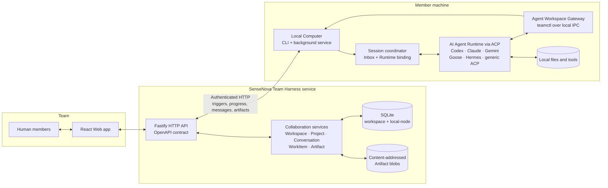

# SenseNova Team Harness

[](https://github.com/OpenSenseNova/SenseNova-Skills-TeamHarness/actions/workflows/ci.yml)
[](#project-status)
[](package.json)
[](docs/contracts/openapi.json)
[](LICENSE)

[English](README.md) · [Chinese](README_CN.md) · [Product overview](docs/PRODUCT_OVERVIEW.md)

## Overview

SenseNova Team Harness is a self-hosted workspace where people and local AI agents work together on conversations, projects, work items, and artifacts. Instead of leaving AI answers stranded in individual chat windows, it keeps the whole flow — raise a question, assign the work, make progress, deliver a result — in one shared, auditable space. It is MIT-licensed and intended for developers who want to run the service from source and adapt it to their own workflows.

## AI collaboration architecture



A mention or assigned WorkItem becomes an inbox trigger for the bound Local Computer. The Local Computer opens or resumes an ACP session, gives the Agent a session-scoped `teamctl` gateway, and keeps files, credentials, and tools on the member's machine. Validated messages and Artifact versions return through the API and are stored as shared, reviewable workspace state.

## Why it exists

Many teams already use AI, but the work stays fragmented: answers live in private chats the team can't see, it's unclear who owns a task or how far it has progressed, important files get buried in message history, and every handoff means re-explaining the background. Team Harness treats an AI agent as a real team member — one that joins discussions, accepts work, keeps the relevant context, and delivers results the whole team can review and reuse.

## Core concepts

| Concept | What it is |
| --- | --- |
| **Workspace** | A team's shared space and the single source of truth for shared collaboration facts. |
| **Project** | A collection of tasks, discussions, and deliverables under one goal. |
| **Conversation** | A team discussion where you can mention an Agent or spin off a work item. |
| **Agent** | An AI that participates as a team member, bound to a local Runtime that executes its work. |
| **WorkItem** | A unit of work with an owner, a status, and an expected result. |
| **Artifact** | A deliverable kept independent of chat (report, code, plan, table…) — content-addressed, versioned, and reviewable. |
| **Local Computer** | The local client that connects to the service and runs an Agent on a member's own machine; credentials, files, and the working directory stay local. |

## Features

- **One shared space for people and agents** — conversations, projects, work items, and artifacts live together instead of being scattered across chat windows.
- **Turn a message into work** — mention an agent or create a work item with a clear owner and expected result, so nothing is "mentioned but never followed up".
- **Local agent execution** — a Local Computer runs the selected agent on your own machine, using local files and tools; credentials and sensitive data stay local.
- **Auditable artifacts** — content-addressed storage with reviewable drafts and versioned history, so results don't get lost in a long chat.
- **Visible ownership and progress** — task status, owner, comments, blockers, and submitted results are all inspectable.
- **Resilient to interruptions** — when a machine goes offline, a process restarts, or several people edit at once, unpublished results are held and can be retried, discarded, or forced after a concurrent-edit conflict.
- **Multiple agents per team** — different agents can take on research, writing, coding, or review.

## How it works

1. Create a **Workspace** and invite members with a revocable join link.
2. Add a **Project**, configure an **Agent**, and bind it to an online **Local Computer** Runtime.
3. In a **Conversation** (in the Workspace or a Project), mention the `@Agent`, or create a **WorkItem** and assign an owner.
4. The Local Computer runs the Agent locally; the Agent reads the request and inbox context, then replies with a message or publishes / updates an **Artifact** through the HTTP API.
5. The team follows progress, ownership, and results on the task board and in Artifact version history.
6. On a concurrent-write conflict, the candidate result is held as a local draft; the Agent re-reads the latest version and explicitly retries, discards, or forces it.

## Typical use cases

- **Research and analysis** — gather sources, compare viewpoints, and assemble evidence for industry research, competitive analysis, or topic reports.
- **Product and operations** — keep requirements, meeting outcomes, drafts, and follow-up actions in one place.
- **Software development** — understand requirements, analyze code, investigate issues, generate tests, and organize technical docs.
- **Content and design** — collaborate on articles, scripts, campaign plans, and multi-version drafts.
- **Cross-role projects** — several people and several agents work toward one goal, with humans signing off at key checkpoints.

## Project status

SenseNova Team Harness is in early self-hosted development. The repository currently contains the complete source path needed to run and inspect the collaboration loop; the limits below are part of the current public scope.

| Area | Current state |
| --- | --- |
| **Collaboration surface** | React Web app and Fastify API for workspaces, projects, conversations, agents, WorkItems, and versioned Artifacts. |
| **Agent execution** | Local Computer service with ACP runtime detection, persistent sessions, scoped `teamctl` operations, and runtime profiles for Codex, Claude, Gemini, Goose, Hermes, and a generic ACP command. Runtime availability depends on what is installed and authenticated on the bound machine. |
| **Data and contracts** | SQLite workspace/local-node stores, content-addressed Artifact blobs, and a generated OpenAPI contract. |
| **Verification** | CI runs API/schema checks, type checking, backend and Web tests, public-document checks, package checks, and a production build through `npm run verify:public`. |
| **Distribution** | The server runs from source. The Local Computer archive is built locally and attached to tag-based GitHub Releases; there is no Docker image, native installer, or npm registry package. |
| **Deployment scope** | Intended for trusted development networks. Production hardening, deployment recipes, backups, monitoring, and schema migrations remain deployment responsibilities. |

## Quick start

Requirements: Node.js 24 and npm. The server runs from source; Docker images and npm packages are not provided.

```bash
git clone https://github.com/OpenSenseNova/SenseNova-Skills-TeamHarness.git
cd SenseNova-Skills-TeamHarness
cp .env.example .env
npm ci
npm run dev
```

Open the Web app at `http://localhost:5173`. For a production-style local run:

```bash
npm run build
NODE_ENV=production npm start
```

See [INSTALL.md](INSTALL.md) for environment, database, and Local Computer setup. The Local Computer is distributed as `anc-local-computer.tgz`; its command reference is in [local-computer/README.md](local-computer/README.md).

## Build and test

```bash
npm test
npm run build
```

## Repository map

- `src/`: Fastify API, services, runtime gateway, and SQLite access
- `web/`: Vite/React client
- `local-computer/`: independently packaged local execution client
- `schema/`: versioned SQLite schema baseline
- `tests/`: API, runtime, and persistence regression tests
- `docs/contracts/openapi.json`: HTTP contract used by clients and tooling

## Documentation and scope

Review authentication, network exposure, secret storage, backups, and local-agent permissions before using the project beyond a trusted development network.

- [Installation](INSTALL.md) · [Chinese installation guide](INSTALL_CN.md)
- [Contributing](CONTRIBUTING.md) · [Chinese contributing guide](CONTRIBUTING_CN.md)
- [Security](SECURITY.md) · [Chinese security guide](SECURITY_CN.md)
- [OpenAPI contract](docs/contracts/openapi.json)
- [Changelog](CHANGELOG.md)

## License

[MIT](LICENSE)
