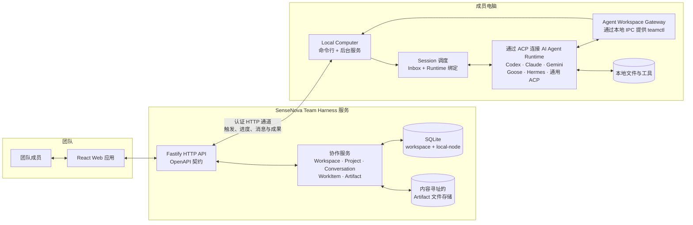

# SenseNova Team Harness

[](https://github.com/OpenSenseNova/SenseNova-Skills-TeamHarness/actions/workflows/ci.yml)
[](#项目状态)
[](package.json)
[](docs/contracts/openapi.json)
[](LICENSE)

[English](README.md) · [产品介绍](docs/PRODUCT_OVERVIEW.md)

## 项目概览

SenseNova Team Harness 是一个**自托管的团队协作工作区**，让人和本地 AI Agent 围绕同一份工作协同：讨论、待办、AI 执行和最终成果都放在同一个空间里，而不是散落在个人聊天窗口、文档和各种工具里。把「提出问题 → 分配工作 → 持续推进 → 交付成果」连成一条完整、可审计的协作链。项目采用 MIT 许可证，便于从源码运行并进行二次开发。

## AI 协作架构



在会话中提及 Agent 或指派 WorkItem 后，服务会为绑定的 Local Computer 生成 Inbox 触发。Local Computer 创建或恢复 ACP Session，通过限定范围的 `teamctl` 网关让 Agent 访问团队上下文，同时把文件、凭据和工具留在成员电脑上。通过校验的消息和 Artifact 版本再经 API 回到 Workspace，成为团队共享、可复核的协作事实。

## 为什么需要它

很多团队已经在用 AI，但工作仍然是碎片化的：AI 的回答留在个人聊天窗口里，团队无法共享；任务交给谁、做到哪一步不清楚；重要文件很快被聊天记录淹没；换个人接手或中断一次，就要把背景重新解释一遍。Team Harness 让 AI 真正作为团队成员参与工作——参与讨论、接受工作、保留必要背景，并交付整个团队都能复核和复用的成果。

## 核心概念

| 概念 | 说明 |
| --- | --- |
| **Workspace** | 团队共享空间，是共享协作事实的唯一权威来源。 |
| **Project** | 一个目标下的任务、讨论和交付物的集合。 |
| **Conversation** | 团队讨论；可以在其中 @Agent 或创建待办。 |
| **Agent** | 作为团队成员参与的 AI，绑定一台本地 Runtime 执行工作。 |
| **WorkItem** | 一项待办工作，有负责人、状态和预期结果。 |
| **Artifact** | 独立于聊天的成果（报告、代码、方案、表格等），内容寻址存储、可版本化、可审核。 |
| **Local Computer** | 连接服务并在成员自己电脑上运行 Agent 的本地客户端；凭据、文件和工作目录都留在本地。 |

## 功能

- **人和 Agent 共用一个空间** —— Conversation、Project、WorkItem 和 Artifact 放在一起，而不是散落在各个聊天窗口。
- **一句话变成一项工作** —— 在会话中 @Agent 或创建待办，明确负责人和预期结果，避免「说过了但没人跟进」。
- **本地执行 Agent** —— Local Computer 在你自己的电脑上运行选定的 Agent，使用本地文件和工具，凭据与敏感数据留在本地。
- **可审计的成果** —— Artifact 使用内容寻址存储，支持可审核草稿和版本历史，结果不会淹没在长聊天里。
- **过程和责任清楚可见** —— 任务状态、负责人、评论、卡住原因和已提交结果都可查看。
- **中断可恢复** —— 电脑离线、程序重启或多人同时修改时，未发布的结果会被保留，冲突后可显式 retry、discard 或 force。
- **一个团队多个 AI** —— 不同 Agent 分别承担研究、写作、编程和审阅等工作。

## 工作方式

1. 创建 **Workspace**，通过可撤销的 Join Link 邀请成员。
2. 添加一个 **Project**，配置 **Agent**，并为其绑定一台已上线的 **Local Computer** Runtime。
3. 在 Workspace 或 Project 的 **Conversation** 中提及 `@Agent`，或创建 **WorkItem** 指派负责人。
4. Local Computer 在本地运行 Agent；Agent 读取请求和 Inbox 上下文后，用消息回复，或通过 HTTP API 发布 / 更新 **Artifact**。
5. 团队在任务看板和 Artifact 版本历史中查看进展、负责人和最终成果。
6. 并发写入冲突时，候选结果保留在本地草稿；Agent 读取最新版本后显式 retry / discard / force。

## 典型场景

- **研究与分析** —— 收集资料、比较观点、整理证据，完成行业研究、竞品分析和专题报告。
- **产品与运营** —— 把需求、会议结论、方案撰写和后续行动放在一起。
- **软件研发** —— 理解需求、分析代码、排查问题、生成测试和整理技术文档。
- **内容与设计** —— 协作完成文章、脚本、活动方案和多版本内容。
- **跨角色项目** —— 多个成员和多个 AI 围绕同一目标分工推进，由人在关键节点验收。

## 项目状态

SenseNova Team Harness 目前处于早期自托管开发阶段。仓库已经包含运行并检查完整协作闭环所需的源码；下表同时列出当前公开范围，避免把尚未提供的能力误认为可用。

| 领域 | 当前状态 |
| --- | --- |
| **协作界面** | 提供 React Web 应用与 Fastify API，覆盖 Workspace、Project、Conversation、Agent、WorkItem 和版本化 Artifact。 |
| **Agent 执行** | Local Computer 提供 ACP Runtime 检测、持久 Session、限定范围的 `teamctl` 操作，以及 Codex、Claude、Gemini、Goose、Hermes 和通用 ACP 命令的 Runtime 配置。实际可用性取决于绑定电脑是否已安装并完成认证。 |
| **数据与契约** | 使用 SQLite 保存 workspace/local-node 数据，使用内容寻址文件保存 Artifact，并维护生成的 OpenAPI 契约。 |
| **验证流程** | CI 通过 `npm run verify:public` 执行 API/schema 校验、类型检查、后端与 Web 测试、公开文档检查、打包检查和生产构建。 |
| **分发方式** | 服务端从源码运行；Local Computer 压缩包可在本地构建，并在版本标签触发的 GitHub Release 中作为附件发布。当前没有 Docker 镜像、原生安装器或 npm registry 包。 |
| **部署范围** | 面向受信任的开发网络；生产加固、部署方案、备份、监控和 schema 迁移仍需部署方自行完成。 |

## 快速开始

环境要求：Node.js 24 和 npm。服务端从源码运行；不提供 Docker 镜像和 npm 包。

```bash
git clone https://github.com/OpenSenseNova/SenseNova-Skills-TeamHarness.git
cd SenseNova-Skills-TeamHarness
cp .env.example .env
npm ci
npm run dev
```

浏览器打开 `http://localhost:5173`。如需生产模式本地运行：

```bash
npm run build
NODE_ENV=production npm start
```

环境变量、数据库和 Local Computer 配置见 [INSTALL_CN.md](INSTALL_CN.md)。Local Computer 以 `anc-local-computer.tgz` 分发，命令参考见 [local-computer/README.md](local-computer/README.md)。

## 构建与测试

```bash
npm test
npm run build
```

## 目录说明

- `src/`：Fastify API、业务服务、Runtime 网关和 SQLite 访问
- `web/`：Vite/React 客户端
- `local-computer/`：独立打包的本地执行客户端
- `schema/`：版本化 SQLite schema 基线
- `tests/`：API、Runtime 和持久化回归测试
- `docs/contracts/openapi.json`：客户端和工具使用的 HTTP 契约

## 文档与范围

将服务暴露到非信任网络前，请自行评估认证、网络边界、密钥存储、备份和本地 Agent 权限。

- [产品介绍](docs/PRODUCT_OVERVIEW.md)
- [安装](INSTALL_CN.md) · [Installation](INSTALL.md)
- [贡献指南](CONTRIBUTING_CN.md) · [Contributing](CONTRIBUTING.md)
- [安全说明](SECURITY_CN.md) · [Security](SECURITY.md)
- [OpenAPI 契约](docs/contracts/openapi.json)
- [变更记录](CHANGELOG.md)

## 许可证

[MIT](LICENSE)
