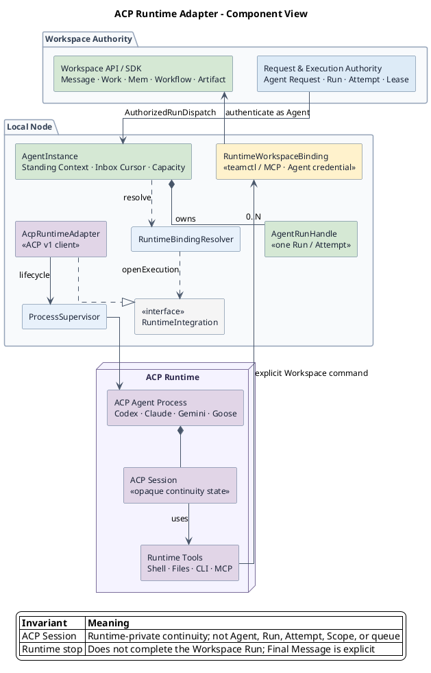
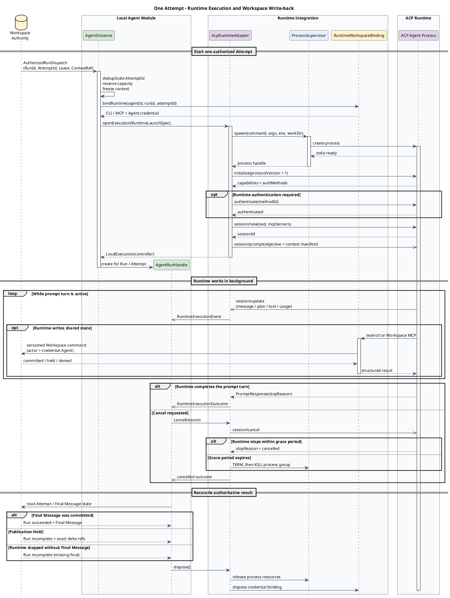

# Local Agent Module：Agent Instance、Workspace 写回与 ACP Runtime

> 状态：Step 6 Proposed
> 上游：`CONTEXT.md`、`docs/ARCHITECTURE_V2.md`、ADR-0001、ADR-0002、ADR-0003、ADR-0006、ADR-0007、ADR-0008、ADR-0011、ADR-0014、ADR-0015
> 本文范围：统一定义本地 Agent Instance、Runtime 对 Workspace 的 CLI/MCP 写回能力，以及首个 ACP v1 stdio Runtime Adapter。

## 1. 本层要解决的问题

Workspace 中已经存在一个稳定的 Agent，例如“代码审查 Agent”。该 Agent 当前配置使用 Codex，但它不能因此被实现成一个 Codex 进程：

- Agent 要在没有任务、没有 Runtime 进程时仍然存在；
- Agent 的身份、规则和长期上下文要跨任务、Attempt 和 Runtime 替换保留；
- 同一个 Agent 可以在容量允许时执行多个任务；
- 任一 Runtime 进程崩溃，只能影响对应 Attempt，不能销毁 Agent；
- Runtime 不是独立 Workspace Principal；V1 把它视为 Agent 的受信执行器，可通过当前 Agent 的 Workspace Access Binding 调用 CLI/MCP，但不能决定 Agent 的共享权限、任务归属或完成状态。

因此 Local Agent Module 必须先创建一个 **Agent Instance**，再由它为每个 Attempt 启动独立的本地执行。

本文的核心关系是：

```text
Workspace Agent（团队中的稳定身份）
        │ active Agent/Device Binding
        ▼
Agent Instance（该 Agent 在一台 Device 上的长期本地承载）
        ├── Standing Agent Context
        ├── Agent Home
        ├── Assigned Request cursor + wake buffer
        ├── capacity / intake state
        └── active runs 0..N
                ├── Attempt-A → AgentRunHandle → Runtime execution / session
                └── Attempt-B → AgentRunHandle → Runtime execution / session
```

### 1.1 组件架构图

![Agent Instance、ACP Runtime 与 Workspace 写回组件图](https://kroki.io/plantuml/svg/eNp1Vs2S4jYQvvspVExVDqmBXf5mgK1srTE4oTIzRQ2p5MJFYzeMaoTkyDIwG_JE-wA57I0nS7ewwQZ2p2qN1J--7v661faX1HJjs5X0rLASmB9M2XOmrFjh75gnFgyrs0CvEq1AWfangI3nWZ0wq9mLtlavWCwMRFZo5aVvQiXc8BVLX3msN0It2YLLFEqWFx69LY3OVBxoqQ27Cd2_EkIKBfY9AaaNfdUlQwwLnkkbamWfOAVoBJfX7TPxFVizVTL6xuhN7rJz3-3e9UvGqEhwZt9RBcqHq6WEaxD2j8fY8DyLcS9shkOyaBODKRyFd8Oej7sUU77XvG99bLe9f0vcCbLxJVxnDnuhHwbnzP2O3x72qsztdqfZ7VaYlY5_RNsN2yj7Ge19cBf2h1Xa1rjV74zPaO2PaMNwOPbPaYOe30OKarRhu9vsI61XpF_7S5u3FFdY2gxLb4R9rzGestM--TxVovYMf2eQWvYTG28hyqgJT0fnyl8SqgDt_6PWpodvLawSt_MAPAXnJIcdj7Ob0Wg8DO-rHkshTifsA5uNfp-rR0hTSgD5yE7PR1gVy4XUG-fVWLHgka2m5CcCPXXHvVGnosWDjrhkT1g_h3fLp6KapYBcjhOF91hFMFczfMZ07wJUGrYux4l60VsWZCZF3XEdcPRSaFs5f4zk0gVK9xtSS_Sx_4YGp-WHQsr994OGBeg6UT5ZhsKF-AyplmswufqHRfXA_pvALAyqBvvvc5Wfn-De0nCqduGVtqc4L1xf499ZAlGSY_KZRjnQqFs3WSQFYvL4EVhMvZtxE1M4q_7U6AhrPcsSMGuBcrpTF7tXsz5WPE-fYrDAV5GVqOMjRkM94jo2MhDjE6dbHtf5WXfPWkHgoadqAX-u11ntY6PxVCsVY8D0RqUX2Ebj81F3xJjDT4QdNx2ipC4SJaCOd40YT4o1GrsKumqt1z9fCoWEUiwgeo9w1mL3u3FVK72EyvW92v0IPWiWc89VgLCta3PJs9hdyl9hJZRwv7ROK6T5sevlJvYZWjFV1_UJxxGBADypMhoRKKSFU-8TYY6_Tli8Wv_QWmKos1eQksIKhYTUxfwwcdMjmJY5HfzISAWqBk9Fr7o_YYp4SP8K3YBlKaSk-sXkI2y1VQbFWP0KMbKMBHajjV69y4qW_ORGr-KW7BftPGCwTaTAoVSa9ajbCvvXu0BXKGh-DhjH6OjGRFiP41TzPAn4jPMPFdRk9wsOwzXH7wasBi4egSti3JGNlcqNqzzqemLEmlhPZf9E77-Di1uC3RZT8JbNIrwgt_jlwlBS7JUDcVH2lD6cdmyksdhEQZ0hAbkx-FLiCP-ELaFw_hdvFpGeFNp5QLeaMvO-4H_49fY_AO5pJA)

图中的关键边界是：Workspace 只向 `AgentInstance` 派发已授权 Attempt；`AgentInstance` 通过协议无关的 `RuntimeIntegration` 创建一次本地执行；Runtime 使用 `RuntimeWorkspaceBinding` 中的 Agent 身份调用 Workspace，而 ACP Session 始终只是 Runtime 私有连续性状态。

### 1.2 单次 Attempt 时序图

![单次 Attempt 的 Runtime 执行与 Workspace 写回时序图](https://kroki.io/plantuml/svg/eNqNV01vGzcQve-vGNgXCbVgOInbwICDKLLVGLUbwy7qiy8Ud2SxocgtybWc_Po-cr8oR0Lji1bamTczb94M6Y8-CBfqtS6CCprpi2GahsDrKtCE7moT1Jrp8oVlHZQ1JExJD9Z99ZWQTA9OBZ4shPxaFCtVMi2tDQv7UvivylTCiTX5lSjtRpknWgrtOXsT3Z6crU05s9o6Opynv8yi5KWodZhbE_4USGPqlNC739-r70wnb7KXU-fspkV--_bdyelpUZQiiIXwTAd9DY9mWoeVRSHfDkj4rLiYz7uLX4sCBdHBtZVC0_SJTaAbW9aaD2Dxfj6dzwoihAxKqkrg7UEyujJg1khOoI3b4cXp5fuLdzvNwfRncKsb--axd2CQHlltMumacmUCPzkR27I_FVm15tNSVIFdk07zTIeXJ4jw22unW2cle39fV-yelbeN0_AVfu_nJ_NPr_3aSD2Dn5Qp0fjk3T4nUt_MZq9Kms5uO63tLwU2DY9tfgm3I6Mrpcc9P6f7KG2yULRoWvydy17c5-dFMfR68qHFPqNpbwvsC4X3Qa4ezQjfrsqjzj8-XjOkdEQzyI9fwh0vx4WQQT2LwA1a0WBm4CWXdaWVTCYd0qNx7MEtkxTIBkp8NEvHDEXLBnsA6ng8owWe2upHIikOKbkmSdFBj4vOYZJlMbu-omO6AaG_tL9JxyU-43hlSbcyOSNbsel3wKiNei1qI1f3Fcu87san6HwBkwnnjEDnxoykXa8hcSTqnvwRsXk-og2acaFchjU4FhkGELumn8W8o2XVKGJwbS2KznLyQx6hVJbgXX7bAt8qu4WlVRrHouRdqeWlDokpoyKbkNEIKMFKq_9m5-MKPaeT8VZiQ8DY_4XScGWP3kTZ3jDkWPqisBBt5xVfxHbJNP0o499aoYMYmZ3JZOY8WifAKA2i3Vnk5mWcqD01enCD8MeGNyO5QTfXsrqPOnZ-X4Gty1WZIe6CBGfQ78gu_uFIOYOMdhQIwlFL9mE8QGTSTmt6kGp0clZrhq6y9nUqbeXTrNtB-O367eW1hDKQI2amndktrDTpcd90ZUQleyggO-HSutHWVvSwUjoJNi6hUDtDylMC47whH3awdlxXOMBwYqGH3mPmkVClRcwrWKvxUcdfx1syyKppwXt2Lp9T5kS5tDbxSPfx2IagMCYICIs8s2wHBRZrGTSBn2GXYq8kj56h1j792K-jD5nHGT03s8H55aJdEigXSIhwnm2phvVxgsy2-FZy0V-hXyWIWbGOH_BWaUyyRLYlHVwt0RU4YSfjbpFss24PtcS5SLMh9MAeYlaaI4EYobzLe4ftNtncsa-s8TzywVZ3OFes-ek2fqkDwnLBuF7RLN45dNoImJFUa-v4atFEs5HbGenHcWzMYZbXGlP1tFFhBanjIoIGYCkqW27rZXv--_JiOxOqTkmm5H_PQIhfKuw0n8D2nSZ_Xd7dHEWqDf1xdX3dL-w4dFXboz0s9sHJdvzFZsYxZmwNGae0vTZgBuIKagSRJnmgNBdxPE36-8UxzZWBUG_aUW0mKYll-8UGt5heqsVrOeddJ19LyRiBEutwC6Tp_W290N2R8Nnq_wFTphMr0PgFCofOdRAoY-kbwLzTFaLGXoOtV7F_NsporaAm8zRZRvdxw_cucZa4dFnMwnjvLcKxjnevvt9oja0dHnOPYRO0gPn-WLRznI12d2f4iMTwD9F_HxV3ow)

这条时序强调两个不同的完成条件：ACP `stopReason` 只结束 Runtime turn；只有 Runtime 显式调用 Workspace command 并成功提交 Final Message，Workspace Run 才能成功。

## 2. 明确的对象边界

### 2.1 Agent Instance 是什么

Agent Instance 是一个 Workspace Agent 在一台已绑定 Device 上的长期本地承载对象。它负责：

- 绑定 Workspace Agent、Device 和当前 Runtime Binding；
- 持有任务无关、Runtime 无关的 Standing Agent Context 版本引用并物化本地视图；
- 管理本地 Agent Home、私有上下文引用和恢复记录；
- 跟踪 Assigned Request Inbox 的读取位置并接收实时唤醒提示；
- 执行本地 intake 和并发容量限制；
- 为每个已取得 Execution Lease 的 Attempt 组装输入并创建 Local Execution；
- 把每个 Attempt 隔离到独立工作目录、Workspace Access Binding 对象和 Runtime handle；
- 在进程重启、Runtime 崩溃和短暂断网后恢复本地状态。

在同一 Device 上，Agent Instance 跨多个 Agent Request、Run、Attempt 和 Runtime execution 存活。替换 Codex 为 Claude，或者某个 Codex 子进程退出，都不创建新的 Workspace Agent，也不丢失 Agent Instance 的长期上下文。

### 2.2 Agent Instance 不是什么

| 容易混淆的对象 | 与 Agent Instance 的区别 |
|---|---|
| Workspace Agent | Agent 是共享身份和作者；Agent Instance 是该身份在一台 Device 上的本地承载，没有第二个 Workspace 身份。 |
| Agent Request | Agent Request 是一次持久请求；Agent Instance 可以先于它存在并处理很多请求。 |
| Run / Attempt | Run 是逻辑执行，Attempt 是一次具体执行；它们都是 Agent Instance 的短期工作。 |
| Runtime | Runtime 是 Codex、Claude、Gemini、Goose 等可替换执行引擎；Agent Instance 不实现模型推理。 |
| Runtime process / session | 它们是某个 Attempt 的执行资源；Agent Instance 在它们关闭后仍存在。 |
| AgentRunHandle | 它是 `run()` 为一个已有 Workspace Run / Attempt 返回的本地控制对象，生命周期短于 Agent Instance。 |
| 消息队列 | Agent Instance 不保存任务权威队列；Assigned Request Inbox 由 Workspace Authority 从持久事实重建。 |
| Agent Home | Agent Home 是 Agent Instance 使用的本地存储目录，不是具有行为的实例本身。 |

## 3. 实例的唯一性与绑定

一个活动本地实例由以下三元组确定：

```text
AgentInstanceKey = (WorkspaceId, AgentId, DeviceId)
```

并用 `bindingRevision` 防止旧绑定继续执行。约束如下：

1. 同一进程内，同一个 `AgentInstanceKey` 至多有一个非终止实例；
2. 同一个 Agent 可以先后或按 Workspace 政策在不同 Device 上形成不同本地实例，但这些实例都不是新的 Agent；
3. Device 迁移时，旧实例进入 Draining，新实例从 Workspace 共享上下文重新物化；
4. 只存在于旧 Device 的私有上下文不会自动迁移；必须经过显式导出、授权和导入；
5. Runtime Binding 的变更只替换未来 Local Execution 使用的执行引擎，不自动重建 Agent Instance；
6. 已启动 Attempt 固定使用启动时记录的 binding revision 和 Runtime descriptor，不在运行中静默换 Runtime。

## 4. Agent Instance 持有哪些内容

以下是本层的规范数据形状。字段名用于明确职责，不要求 Workspace 与 Local Node 使用同一种编程语言。

```ts
type AgentInstanceRecord = {
  key: {
    workspaceId: WorkspaceId;
    agentId: AgentId;
    deviceId: DeviceId;
  };

  binding: {
    bindingRevision: number;
    hostMemberId: MemberId;
    runtimeBindingRef: RuntimeBindingRef;
  };

  lifecycle: "provisioning" | "ready" | "draining" | "stopped" | "faulted";

  standingContext: {
    sharedVersion: ContextVersion;
    localPrivateVersion: ContextVersion | null;
    materializedPath: AbsolutePath;
  };

  intake: {
    configuredMaxParallelAttempts: number;
    lastAssignedRequestCursor: InboxCursor | null;
  };

  recovery: {
    lastCleanShutdownAt: Instant | null;
    pendingCandidateCount: number;
  };
};
```

进程内还维护：

```ts
type AgentInstanceLiveState = {
  wakeBuffer: BoundedWakeBuffer;
  activeRuns: Map<AttemptId, AgentRunHandle>;
  runtimeAvailability: RuntimeAvailability;
  workspaceConnection: WorkspaceConnectionState;
};
```

`AgentRunHandle` 是 Agent Instance 对一个 Workspace Run / Attempt 的本地控制对象；它不是新的共享领域身份。`Runtime process`、ACP `sessionId`、PID、stdio handle 和 Runtime 取消令牌只能封装在该 handle 的 `LocalExecution` 内，不能放在 Agent Instance 的身份或 Standing Agent Context 中。

## 5. Standing Agent Context

### 5.1 定义

Standing Agent Context 是 Agent 自己长期持有、且不随某个任务或 Runtime 改变的上下文。它至少包含：

- Agent 身份说明：名称、角色、职责边界；
- 长期指令：工作方式、质量标准、必须遵守的限制；
- 协作约定：沟通风格、何时提问、何时保持沉默；
- 长期记忆或知识引用：已确认事实、经验、索引和来源；
- 默认能力声明与使用偏好，但不包含某次执行的临时授权；
- 上下文版本、来源和更新时间。

它明确不包含：

- 当前 Agent Request 的正文；
- WorkItem、Run、Attempt 或 Execution Lease 状态；
- Run Context Snapshot；
- 当前 Runtime、模型、ACP session、PID 或进程历史；
- 未经 Private Context Grant 允许使用的 Owner 私有内容；
- 某个任务的临时工作目录和中间产物。

### 5.2 共享部分与本地部分

Standing Agent Context 分成两个权威范围：

| 部分 | 权威位置 | 迁移语义 |
|---|---|---|
| Shared Standing Context | Workspace Authority 中的版本化结构化记录 | 跟随 Agent，可在新 Device 重新物化。 |
| Local Private Agent Context | Host 的 Local Custody | 默认只在当前 Device，不因 Agent 绑定迁移而自动上传。 |
| Runtime Materialization | Agent Home / Attempt input 中的只读文件视图 | 是缓存或投影，可以从权威版本重建。 |

如果一条长期记忆必须在换机器后仍然存在，就必须通过明确的共享上下文更新用例提交给 Workspace；不能依赖某台机器上的 `MEMORY.md` 恰好还在。

### 5.3 每次执行拿到什么

每个 Attempt 启动时组装一次不可变输入：

```text
Execution Context
  = Standing Agent Context Snapshot
  + Run Context Snapshot
  + explicitly granted Private Context Snapshot
  + execution envelope
```

其中 execution envelope 只包含当前 Attempt 必须知道的目标、预算、工作目录、可用能力和 Workspace CLI/MCP 使用说明；凭据本身不进入这个 Runtime-readable 文本快照。

每个快照都记录来源版本。Standing Agent Context 在 Attempt 运行期间发生更新时：

- 已运行 Attempt 继续使用原版本；
- 新 Attempt 使用新版本；
- 不向已有 Runtime session 静默热更新；
- 如确有必要刷新，必须形成可审计的显式执行输入事件。

Runtime Adapter 只负责把已经组装好的快照渲染并传给 Runtime，不拥有 Standing Agent Context，也不能自行改变它。

## 6. Agent Home 与文件形态

Agent Instance 需要本地目录，但“有文件”不等于“文件就是所有共享事实的权威数据库”。建议的 V1 目录如下：

```text
agent-home/
└── <workspace-id>/
    └── <agent-id>/
        ├── instance.json
        ├── state.db
        ├── shared-context/
        │   └── <shared-version>/
        │       ├── AGENT.md
        │       ├── instructions.md
        │       └── manifest.json
        ├── private-context/
        │   ├── sources/
        │   └── notes/
        ├── attempts/
        │   └── <attempt-id>/
        │       ├── input/       # frozen runtime-readable projection
        │       ├── work/        # task-specific mutable workdir
        │       └── recovery.json
        └── recovery/
            └── pending-candidates/
```

各位置的语义：

- `instance.json`：便于诊断的非敏感实例摘要；不能单独恢复共享权威事实；
- `state.db`：本地事务状态，例如 inbox cursor、上下文版本、Attempt 恢复索引和 pending candidate 索引；
- `shared-context/<version>`：Workspace 共享上下文的不可变本地投影；
- `private-context`：Local Custody 下的来源文件或笔记，只有获得相应 grant 时才进入执行快照；
- `attempts/<attempt-id>/input`：该 Attempt 的只读上下文，多个 Runtime 不共享可写输入文件；
- `attempts/<attempt-id>/work`：只属于该 Attempt 的可写工作目录；
- `recovery`：尚未提交的候选结果和重启恢复元数据。

下列内容禁止写进 materialized context 或普通 JSON/Markdown：

- Workspace 长期凭据；
- API key、OAuth token、SSH 私钥；
- 未授权的 Owner 私有内容；
- 用于冒充 Agent、Owner、Workspace 或权限的可修改字段。

Credential 只在 Agent Home 中保存引用。Local Custody 在创建 RuntimeWorkspaceBinding 时解析当前 Agent 的凭据或 CLI profile，并通过进程环境、凭据文件引用或 MCP server 配置传给 Runtime。秘密值不得写入 materialized context、普通日志或 recovery JSON。

### 6.1 长期记忆的写入

Runtime 不得直接修改正在被其他 Attempt 读取的共享 `MEMORY.md`。它只能提交 `ProposedContextChange`：

```ts
type ProposedContextChange = {
  agentId: AgentId;
  baseContextVersion: ContextVersion;
  sourceAttemptId: AttemptId;
  target: "shared" | "local-private";
  operations: ContextPatch[];
};
```

- 共享变更由 Workspace 权限和版本前置条件检查后产生新版本；
- 本地私有变更由 Agent Instance 的 context store 串行提交并产生新本地版本；
- base version 不匹配时进入明确的合并或拒绝流程，不能最后写入者静默覆盖；
- Runtime 看到的 `MEMORY.md` 只是某个版本的只读渲染。

这样两个并行 Attempt 可以读取同一版本，但不能通过并发写同一文件破坏长期记忆。

## 7. 谁创建 Agent Instance

`create/ensure Agent Instance` 属于 **Local Agent Module**，不属于 Runtime Adapter，也不属于 Codex/Claude。

Local Agent Module 内有一个直接职责明确的组件：`AgentInstanceManager`（本地 Agent 实例管理器）。它对上层暴露幂等创建/恢复、查找和停止操作：

```ts
interface AgentInstanceManager {
  ensureAgentInstance(
    binding: AuthorizedAgentDeviceBindingSnapshot
  ): Promise<AgentInstanceHandle>;

  getAgentInstance(
    key: AgentInstanceKey
  ): AgentInstanceHandle | null;

  stopAgentInstance(
    key: AgentInstanceKey,
    mode: "finish-active" | "cancel-active",
    reason: AgentInstanceStopReason
  ): Promise<StopResult>;
}
```

`ensureAgentInstance` 的含义是“存在就恢复并返回，不存在就创建”，而不是“启动 Codex”。它执行：

1. 向 Workspace 读取并验证 Agent 状态、Owner/Host、Device Binding 和 binding revision；
2. 取得 Shared Standing Context 的当前版本；
3. 创建或打开 Agent Home，并校验本地记录与绑定是否一致；
4. 物化共享上下文的不可变文件视图；
5. 加载本地私有上下文目录和版本索引，但不默认把内容授予任何 Run；
6. 恢复 Assigned Request cursor、pending candidate 和未完成 Attempt 索引；
7. 检查 Runtime Binding 是否可解析、可启动，但此时不创建 Runtime process/session；
8. 注册实时 wake listener，并立即通过 Workspace Assigned Request Inbox 做一次恢复性读取；
9. 状态进入 `ready`。

如果共享 Standing Agent Context 无法读取或校验，实例必须 fail closed 进入 `faulted`，不能使用空白 persona 启动任务。

### 7.1 一个具体例子

配置“代码审查 Agent，Runtime = Codex”时顺序是：

```text
Workspace 已有代码审查 Agent
→ Local Agent Module 收到该 Agent 对本机的有效 Binding
→ AgentInstanceManager.ensureAgentInstance(...)
→ 创建/恢复代码审查 Agent Instance 与 Agent Home
→ 此时没有 Codex 进程也没有 Codex session
→ 某个 Agent Request 产生 Run，Device 取得 Attempt lease
→ Local Node 调用 agentInstance.run(authorizedRunDispatch)
→ Agent Instance 冻结该 Attempt 的上下文与权限
→ run() 内部通过 Codex Adapter 创建 Local Execution
→ 返回 AgentRunHandle
```

所以要区分四个不同动作：

| 动作 | 所属层 | 创建结果 |
|---|---|---|
| `CreateAgent` | Workspace Collaboration / Governance | 稳定 Workspace Agent |
| `ensureAgentInstance` | Local Agent Module | 该 Agent 在本机的长期实例 |
| `AgentInstance.run` | Agent Instance | 已有 Workspace Run / Attempt 的本地控制 handle |
| `openExecution` | Runtime Integration Adapter，供 `run()` 内部调用 | 某个 Attempt 的 Runtime process/session |

## 8. 生命周期

Agent Instance 使用以下生命周期：

```text
absent
  │ ensureAgentInstance
  ▼
provisioning ───── valid ─────► ready ───── drain ─────► draining ─────► stopped
     │                           │
     └──── invalid ──► faulted ◄─┘

faulted / stopped ── ensure after repair and reauthorization ──► provisioning
```

状态含义：

- `provisioning`：校验绑定、打开 Agent Home、物化上下文和恢复游标；不接收新 Attempt；
- `ready`：可接收 wake 和获取请求；可以有 0..N 个 active runs；
- `draining`：不启动新 Attempt，等待、取消或移交当前执行并持久化候选状态；
- `stopped`：本机承载已停止；共享 Agent 仍然存在；
- `faulted`：关键上下文、绑定或本地恢复状态不可信；修复前不执行。

`idle`、`busy`、`offline` 不做生命周期状态：

- idle/busy 由 active execution 数量派生；
- Workspace 网络连接是独立维度；
- Runtime availability 是独立维度。

这样不会出现“离线但正在做本地计算”或“ready 且已有一个执行”无法表达的问题。

## 9. 消息入口：Inbox 与 Wake Buffer

Agent Instance 不新建一套本地任务队列。任务权威仍是 Workspace 中的 Agent Request、Run 和 Assigned Request Inbox。

本机只需要一个有界 `WakeBuffer`：

```ts
type WakeHint = {
  workspaceId: WorkspaceId;
  agentId: AgentId;
  requestId?: AgentRequestId;
  committedPosition?: WorkspacePosition;
};
```

规则：

1. wake 只表示“Workspace 中可能有新事实”，不携带完整 prompt；
2. buffer 可以按 Agent 合并重复 wake，但不能合并、删除或确认 Agent Request；
3. 收到 wake 后，Agent Instance 通过 `reconcileWorkspaceState()` 使用持久 cursor 重新读取 Assigned Request Inbox，并取得可运行的授权 dispatch；
4. 实时通知丢失时，重连、周期恢复检查或进程启动后的 inbox refresh 仍能发现请求；
5. cursor 表示已经稳定观察到的 Workspace 位置，不表示模型已经完成请求；
6. 超过并发容量的请求继续留在 Workspace 可重建 Inbox 中，不靠内存 buffer 保活。

原始实时事件不能直接作为 `run()` 输入。`@Agent` 事件必须先由 Workspace 原子形成 Message、Agent Request 和后续授权的 Run；Agent Instance 拉到对应 `AuthorizedRunDispatch` 后才调用 `run()`。这样重复 wake 不会重复启动 Runtime，丢失 wake 也不会丢失 Run。

这吸收了 [Buzz 调研](../research/buzz.md)中的 worker pool / 多 session 隔离，以及 [Raft Inbox 调研](../research/raft-inbox.md)中的“wake 与正文分离”，但不继承进程内队列丢失即丢任务的问题。

## 10. 一个 Agent 同时执行多个任务

答案是：**模型允许，一个 Agent Instance 可以同时拥有多个 AgentRunHandle，每个 handle 封装一个独立 Local Execution；是否实际并行由三层容量共同限制。**

```text
effective parallelism
  = min(
      Workspace 对 Agent 的 intake / policy 上限,
      本机配置与资源上限,
      Runtime Adapter 声明的安全并行上限
    )
```

每个并行 Attempt 必须拥有独立的：

- `AttemptId` 和 Execution Lease；
- Standing Agent Context version 与 Run Context Snapshot 引用；
- 工作目录；
- 独立的 RuntimeWorkspaceBinding 和审计关联信息；V1 允许底层复用同一 Agent credential/profile；
- Runtime execution handle；
- 取消、超时和恢复记录；
- 候选输出与提交幂等键。

```ts
type AgentRunHandleState = {
  runId: RunId;
  attemptId: AttemptId;
  localExecution: LocalExecution;
  state: "starting" | "running" | "cancelling" | "finished" | "failed";
};

type LocalExecution = {
  executionId: LocalExecutionId;
  attemptId: AttemptId;
  leaseFence: LeaseFence;
  contextManifest: ImmutableContextManifest;
  runtimeDescriptor: RuntimeDescriptor;
  runtimeHandle: OpaqueRuntimeHandle;
  workspaceAccess: RuntimeWorkspaceBinding;
  workDir: AbsolutePath;
  state: "starting" | "running" | "cancelling" | "finished" | "failed";
};
```

Agent Instance 用 `AttemptId` 管理 `activeRuns`，绝不能只用 `AgentId` 保存当前 run 或 session，否则第二个任务会覆盖第一个任务的进程、上下文或取消句柄。重复调用同一个 `AttemptId` 的 `run()` 必须返回已有 handle 或其已记录结果，不能创建第二个 Runtime execution。

V1 默认 `configuredMaxParallelAttempts = 1`，先获得完整隔离和恢复语义。配置大于 1 时：

- 默认每个 Attempt 创建独立 Runtime process/session；
- 只有 Runtime Adapter 明确证明支持安全 multiplex 时才允许共用底层进程；
- 共用进程也不能共用 Attempt 的逻辑 session、工作目录或 RuntimeWorkspaceBinding 对象；
- 没有空余 slot 时不预先创建 Runtime，只保留 Workspace 请求的待处理状态。

## 11. `AgentInstance.run()` 与 Runtime 的边界

`run()` 是 Local Node 驱动一个 Agent 执行已有 Workspace Run 的主要入口。它属于 Agent Instance，不属于 Codex、Claude 或 Runtime Adapter。

这里必须区分两个同名概念：

- **Run**：Workspace Authority 中已经持久化的共享逻辑执行记录；
- **`AgentInstance.run()`**：本机把这个 Run 的当前 Attempt 落到 Runtime 的命令。

`run()` 不创建第二个 Workspace Run，也不接受原始消息正文、任意 prompt 或调用者自报的身份。它只接受 Workspace 已经绑定 Agent、Run、Attempt、Lease 和上下文引用的 dispatch：

```ts
type AuthorizedRunDispatch = {
  workspaceId: WorkspaceId;
  agentId: AgentId;
  agentRequestId: AgentRequestId;
  runId: RunId;
  attemptId: AttemptId;
  bindingRevision: number;
  leaseFence: LeaseFence;
  runContextSnapshotRef: RunContextSnapshotRef;
  privateContextGrantRefs: PrivateContextGrantRef[];
  budget: ExecutionBudget;
  deadline: Instant | null;
};
```

完整顺序是：

```text
Human publishes a Message containing @Agent
→ Workspace atomically commits Message + Agent Request
→ Workspace authorizes the request and creates/returns Run
→ wake only signals the matching Agent Instance
→ Agent Instance reconciles Assigned Request Inbox
→ Device obtains current Attempt Execution Lease
→ Local Node calls agentInstance.run(AuthorizedRunDispatch)
→ run() deduplicates by AttemptId and reserves one execution slot
→ run() freezes Standing Agent Context Snapshot
→ run() obtains Run Context Snapshot and granted Private Context
→ run() creates Attempt workdir and RuntimeWorkspaceBinding
→ run() resolves current Runtime Binding
→ run() internally calls Runtime Adapter.openExecution(launchSpec)
→ activeRuns[AttemptId] = AgentRunHandle
→ run() returns the handle
```

`run()` 对同一个 `AttemptId` 必须幂等：

- 已有 active handle 时返回同一 handle；
- 已有终止恢复记录时返回一个可读取该确定结果的 completed handle，不重启 Runtime；
- binding revision、Lease fence 或权限过期时拒绝；
- Standing Context 无法校验时拒绝；
- 并发容量已满时保持该 dispatch 在 Workspace 可发现状态，不创建本地影子任务；
- 任一步失败都释放预占 slot，并持久化足以恢复的确定状态。

`run()` 无法返回 handle 时只使用结构化 `AgentRunStartError` 拒绝，例如 `at-capacity`、`stale-binding`、`stale-lease`、`context-unavailable` 或 `runtime-unavailable`。拒绝不能确认或删除 Workspace dispatch；后续 reconciliation 仍可在条件恢复后重新调用。

其中传给 Runtime Adapter 的 `launchSpec` 已经是执行级输入：

```ts
type RuntimeLaunchSpec = {
  executionId: LocalExecutionId;
  attemptId: AttemptId;
  objective: string;
  contextManifest: ImmutableContextManifest;
  inputDir: AbsolutePath;
  workDir: AbsolutePath;
  workspaceAccess: RuntimeWorkspaceBinding;
  budget: ExecutionBudget;
  deadline: Instant | null;
};
```

`WorkspaceAccess` 是 Local Agent Module 中一个很薄的绑定边界：

```ts
interface WorkspaceAccess {
  bindRuntime(
    context: WorkspaceAccessContext
  ): Promise<RuntimeWorkspaceBinding>;
}

type WorkspaceAccessContext = {
  workspaceId: WorkspaceId;
  agentId: AgentId;
  runId: RunId;
  attemptId: AttemptId;
  workDir: AbsolutePath;
};

type RuntimeWorkspaceBinding = {
  cli: { command: AbsolutePath; profile?: string } | null;
  mcpServers: McpServerLaunchSpec[];
  secretEnv: OpaqueSecretEnvOverlay;
  attribution: { agentId: AgentId; runId: RunId; attemptId: AttemptId };
  dispose(): Promise<void>;
};
```

V1 只实现 `DirectWorkspaceAccess`：它从 Local Custody 解析 Agent-scoped credential/profile，生成 CLI/MCP 配置，并交给 Runtime。Runtime 因此可以在 Agent 的完整 Workspace 权限内行动；`runId` 和 `attemptId` 是审计关联信息，不是强隔离安全边界。Workspace Authority 仍必须以 credential 对应的 Agent 和当前共享权限对每个命令重新授权；不信任 Runtime 传入的其他 Agent、Owner 或额外权限。

这个设计明确接受与 Buzz/Raft 相似的信任假设：Runtime 是 Agent 的受信执行环境。若未来需要不可信 Runtime、多租户隔离或 Attempt-scoped capability，可增加新的 `WorkspaceAccess` 实现，但不改变 `AgentInstance.run()` 和 `RuntimeIntegration` 的上游契约。

`openExecution` 不是 Local Node 上层直接调用的 Agent API；它只供 `AgentInstance.run()` 内部使用。本层规定 `run()` 的输入、幂等和所有权，并规定它与 `openExecution` 的边界。ACP `initialize`、`session/new`、`session/prompt`、Codex/Claude 启动命令、进程复用和事件翻译属于下一层 Runtime Integration Adapter 设计。

## 12. 失败与恢复

| 故障 | 本层的确定行为 |
|---|---|
| Runtime process/session 崩溃 | 只把对应 Local Execution 标记失败并按 Execution Model 结束或重试 Attempt；Agent Instance 和长期上下文保留。 |
| Local Node 进程崩溃 | 从 Workspace 共享事实、`state.db` 和 recovery 记录重新 `ensureAgentInstance`；运行中的 OS 资源先按 supervisor 规则清理或重新附着。 |
| wake 丢失 | 下次 inbox refresh 从持久位置重新发现请求。 |
| Workspace 暂时离线 | 不取得新 Lease；已授权 Attempt 只可按 Offline Continuation 做有界本地计算，结果保持 candidate。 |
| Execution Lease 到期 | 旧 Local Execution 被 fence，不能继续提交当前权威结果；Agent Instance 本身不停止。 |
| Runtime Binding 失效 | 不启动新 Attempt；现有 Attempt 按绑定版本和政策 drain/cancel；Agent Instance 可等待新 binding。 |
| Standing Context 校验失败 | Agent Instance `faulted`，禁止用空上下文继续。 |
| 长期上下文并发更新冲突 | 按 base version 拒绝或进入显式合并，不做最后写入者覆盖。 |
| candidate 提交结果未知 | 持久保存 payload、幂等键和 expected frontier，先查询 Workspace 再决定重放。 |

恢复时不能从本机 Runtime session、PID 或缓存反推 Agent Claim、Run success、Final Message 或 Workspace 权限。这些共享事实只能从 Workspace Authority 读取。

## 13. 安全约束

1. Runtime 只能获得 Agent-scoped Workspace credential/profile，不得获得 Human、Owner 或 Device 的 Workspace 凭据；
2. Agent credential 只能通过 `OpaqueSecretEnvOverlay`、受限凭据文件或 MCP 进程配置注入，不得进入 context manifest、prompt、日志或 recovery 记录；
3. V1 把 Runtime 视为 Agent 的受信执行器；同一 Agent 的并行 Attempt 可能复用同一 credential，因此不宣称存在 Attempt 级 Workspace 安全隔离；
4. Workspace Authority 仍按 credential 对应的 Agent、当前 Membership 和行为策略重新授权，Runtime 自报的其他 Agent、Owner 或额外 scope 不生效；
5. `runId` 和 `attemptId` 由 Local Agent Module 注入并作为 V1 审计关联，但不当作防御恶意 Runtime 伪造的密码学证据；
6. task prompt 不能直接修改 Standing Agent Context 或 intake policy；私有上下文只有在当前 Run 的 Private Context Grant 覆盖时才物化到 Attempt input；
7. private context 的使用授权不等于允许写入 Final Message；
8. Agent Home 和 Attempt 目录使用当前 Host 的文件权限隔离；
9. 取消一个 Attempt 必须终止其 execution handle 并 dispose 对应 binding，但 V1 不把这等同于撤销 Agent 长期 credential；
10. 旧 binding revision 和旧 Lease fence 必须阻止 Local Agent Module 启动或提交新的权威结果；已在 Runtime 内的 Agent credential 的风险由受信 Runtime 假设承担。

## 14. 最小实现接口

V1 只需要以下本地 Module 关系，不需要先建立更多抽象层：

```text
Local Agent Module
├── AgentInstanceManager
│   └── AgentInstance 0..N
│       └── AgentRunHandle 0..N
│           └── LocalExecution
├── LocalStateStore
├── ContextStore / ContextMaterializer
├── AssignedRequestReader
├── RuntimeBindingResolver
├── WorkspaceAccess
└── RuntimeIntegration
```

对调用者呈现三层接口。

### 14.1 AgentInstanceManager：管理本地实例

```ts
interface AgentInstanceManager {
  ensureAgentInstance(
    binding: AuthorizedAgentDeviceBindingSnapshot
  ): Promise<AgentInstanceHandle>;

  getAgentInstance(
    key: AgentInstanceKey
  ): AgentInstanceHandle | null;

  stopAgentInstance(
    key: AgentInstanceKey,
    mode: "finish-active" | "cancel-active",
    reason: AgentInstanceStopReason
  ): Promise<StopResult>;
}
```

`stopAgentInstance` 先停止接纳新 Run，再按 mode 等待或取消 active runs，最后关闭 Runtime 资源并保存恢复状态。它不删除 Workspace Agent、Agent Home 或 Standing Agent Context。删除和 full reset 必须是单独的显式高风险用例。

### 14.2 AgentInstance：执行这个 Agent 的 Workspace Run

```ts
interface AgentInstanceHandle {
  run(command: AuthorizedRunDispatch): Promise<AgentRunHandle>;

  wake(hint: WakeHint): WakeAcceptance;

  reconcileWorkspaceState(
    reason: ReconcileReason
  ): Promise<ReconcileResult>;

  getStatus(): AgentInstanceStatusSnapshot;

  listRuns(): AgentRunSummary[];
}
```

`wake()` 只安排一次幂等的 Workspace 对账；它不把 hint 当成 prompt，也不确认 Agent Request。`reconcileWorkspaceState()` 统一刷新 Agent 状态、Binding、Standing Context、Inbox、Lease 和 pending candidate；不再对外暴露一个可能绕过其他状态检查的 `refreshAssignedRequests()`。

`run()` 是主要执行入口。容量接纳、Attempt 幂等、上下文冻结和 `RuntimeIntegration.openExecution()` 都是它的内部步骤，不再作为上层需要自行编排的浅接口。

### 14.3 AgentRunHandle：控制一次 Run / Attempt

```ts
interface AgentRunHandle {
  readonly runId: RunId;
  readonly attemptId: AttemptId;

  getStatus(): AgentRunStatus;

  sendInput(
    input: AuthorizedRunInput
  ): Promise<RunInputResult>;

  cancel(
    reason: AuthorizedCancelReason
  ): Promise<CancelResult>;

  waitForCandidate(): Promise<CandidateResult>;
}
```

`sendInput()` 只用于已经明确关联当前 Run 的交互，例如回答 Agent 主动提出的问题，或 Publication Hold 后的显式 reconciliation。普通新消息、新的 `@Agent` 或新任务必须创建新的 Agent Request，不能借 `sendInput()` 静默改变当前 Run Context Snapshot。

`cancel()`、`sendInput()` 和 Runtime 退出处理都只作用于该 handle 对应的 Attempt。Runtime 不支持原生 steer 时，`sendInput()` 返回明确的 `unsupported`，或由下一层 Adapter 规范定义可审计的取消并恢复策略，不能静默丢弃输入。

职责对应：

| 组件 | 只负责什么 |
|---|---|
| AgentInstanceManager | 按 `(Workspace, Agent, Device)` 幂等创建、查找、恢复和停止 Agent Instance。 |
| AgentInstance | 保存该本地 Agent 的长期状态，通过 `run()` 驱动已有 Workspace Run，并编排多个 AgentRunHandle。 |
| AgentRunHandle | 把输入、取消、状态和候选结果限定到一个 Run / Attempt，并封装具体 Local Execution。 |
| LocalStateStore | 事务保存 cursor、版本、recovery 和 pending candidate 索引。 |
| ContextStore / ContextMaterializer | 版本化 Standing Context，并生成每个 Attempt 的只读文件视图。 |
| AssignedRequestReader | 从 Workspace 的可重建 Inbox 拉取请求；wake 只是触发它。 |
| RuntimeBindingResolver | 把当前绑定解析成具体 Runtime Adapter 与能力，不启动任务。 |
| WorkspaceAccess | 把 Agent-scoped credential/profile 与 CLI/MCP 配置组装成 RuntimeWorkspaceBinding；V1 为直连 Workspace 的受信 Runtime 模式。 |
| RuntimeIntegration | 供 `AgentInstance.run()` 和 AgentRunHandle 内部使用，创建、观察、交互和取消一次 Local Execution。 |

不要在第一版增加独立 `AgentInstance Service` 网络服务、单独的消息 broker 或 Runtime 专属 Agent 子类。上述对象都可以先作为同一 Local Agent Module 进程内的深组件实现；只有出现真实部署边界后再拆进程。

## 15. 验收场景

### S-AGENT-INSTANCE-RUN-DISPATCH-01

成员发布一条 `@Agent` Message 后，Workspace 先原子提交 Message 和 Agent Request，再创建授权 Run。重复 wake 只触发幂等 reconciliation；Agent Instance 最终只使用对应 `AuthorizedRunDispatch` 调用一次 `run()`，并为同一个 Attempt 返回同一个 AgentRunHandle。原始实时事件不能直接启动 Runtime。

### S-AGENT-INSTANCE-NO-RUNTIME-01

有效 Agent/Device Binding 被激活后，`ensureAgentInstance` 成功，Agent Home 和 Standing Context 已就绪，但系统中没有 Runtime process/session。

### S-AGENT-INSTANCE-RUNTIME-REPLACEMENT-01

同一 Agent Instance 先用 Codex 完成 Attempt-A，随后 Runtime Binding 改为 Claude。Attempt-B 使用相同 Agent 身份和新 Standing Context version 规则启动；历史作者仍是同一 Agent，Attempt-A 的 Runtime 事实不被改写。

### S-AGENT-INSTANCE-PARALLEL-01

容量为 2 时，同一 Agent Instance 通过两次 `run()` 同时启动 Attempt-A 和 Attempt-B，并返回两个 AgentRunHandle。二者可读取同一 Standing Context version，但有不同 workdir、RuntimeWorkspaceBinding 对象、Runtime handle、取消句柄和候选结果；取消 A 不影响 B。V1 可复用同一 Agent credential，不宣称远程 Workspace 权限已按 Attempt 隔离。

### S-AGENT-INSTANCE-CONTEXT-VERSION-01

Attempt-A 使用 Standing Context V3 运行期间，长期上下文更新为 V4。A 继续使用 V3，新启动的 Attempt-B 使用 V4；系统不会向 A 静默注入 V4。

### S-AGENT-INSTANCE-CONTEXT-CONFLICT-01

Attempt-A 和 B 都基于 V3 提交长期记忆修改。A 成功产生 V4；B 的 base version 冲突，进入拒绝或显式合并，不覆盖 V4。

### S-AGENT-INSTANCE-RUNTIME-CRASH-01

Attempt-A 的 Runtime 崩溃后，A 进入失败/重试流程，Agent Instance 保持可恢复；容量允许时它仍可处理另一个 Agent Request。

### S-AGENT-INSTANCE-RESTART-01

Local Node 重启后，实例从 Workspace、Agent Home 和本地事务状态恢复 inbox cursor、Standing Context version 和 pending candidate；不把缓存误认为共享权威结果。

### S-AGENT-INSTANCE-NOTIFICATION-LOSS-01

Workspace 已提交 Agent Request，但实时 wake 丢失。实例下一次恢复性 inbox refresh 仍发现该请求，且不会产生第二个 Agent Request。

### S-AGENT-INSTANCE-FAIL-CLOSED-01

Shared Standing Context 的 manifest/hash 无法校验时，实例进入 `faulted`，不会以空白指令启动 Runtime。

### S-AGENT-INSTANCE-CREDENTIAL-SCOPE-01

检查 shared-context、Attempt input、日志、instance summary 和 recovery JSON，均不存在 Workspace credential 或 secret 值。RuntimeWorkspaceBinding 只注入 Agent-scoped credential/profile，不注入 Human、Owner 或 Device credential；Runtime 退出后 binding 被 dispose。

## 16. Runtime 如何操作 Workspace

### 16.1 决策与信任边界

V1 不额外实现一个代理所有请求的 execution-scoped Workspace Gateway。Runtime 被视为 Agent 的受信执行器，由 Local Agent Module 为每个 Attempt 组装 `RuntimeWorkspaceBinding`：

```text
AgentInstance.run(AuthorizedRunDispatch)
  → WorkspaceAccess.bindRuntime(agentId, runId, attemptId)
  → RuntimeWorkspaceBinding
      ├── Agent-scoped credential/profile
      ├── teamctl CLI location and environment
      ├── optional team-workspace MCP launch spec
      └── audit correlation
  → Runtime
      → CLI or MCP
      → Workspace API/SDK
      → Workspace Authority
```

Workspace Authority 以 credential/profile 对应的 Agent 为 actor，按当前 Membership 和行为策略重新授权每个 command。`runId` 和 `attemptId` 是 V1 的审计关联，不是强 capability 边界。Runtime 不得获得 Human、Owner 或 Device credential。

这解决了语义与能力之间的 gap：

- Agent Instance 对 Workspace 行为负责，决定当前执行属于哪个 Agent、Run 和 Attempt；
- Runtime 实际拥有 shell、CLI 或 MCP 调用能力；
- `RuntimeWorkspaceBinding` 把 Agent 身份和执行关联安全地装入 Runtime 环境；
- Workspace Authority 仍是最终授权者和共享事实的唯一提交者。

### 16.2 从 Buzz 和 Raft 吸收什么

[Buzz 调研](../research/buzz.md)和 [Raft Inbox 调研](../research/raft-inbox.md)共同说明：shell-capable Runtime 直接调用共享空间 CLI 是一条足够简单的首版路径，Runtime 不需要为每个产品动作都通过 ACP Client 反向代理。

| 系统 | 可复用经验 | 不直接照搬的部分 |
|---|---|---|
| Buzz | JSON-first CLI；Message、Mem、Workflow、文件、Agent/空间管理；Runtime 通过 shell 调 CLI；本地 dev MCP 单独提供文件和 shell 工具 | per-channel 内存队列不是我们的任务权威；本地 dev MCP 不是 Workspace API |
| Raft | Inbox 检查与正文读取分离；Message、Task、Attachment、Reminder、Integration；draft freshness hold | 当前 bridge 主要唤醒已有 Session，不解决同一 Agent 后多个并发 Runtime Session 的调度 |

我们采用的共同模式是：

1. wake 只负责提醒，Workspace Inbox 才保存可恢复请求；
2. Runtime 使用 Agent 身份调用 CLI/MCP；
3. Runtime 输出不会自动变成共享事实；
4. 所有 mutation 都由 Workspace Authority 重新授权并返回结构化结果；
5. 新消息导致上下文过期时，Final Message 进入 Publication Hold，而不是盲目发送。

### 16.3 能力分层

| 层级 | 定义 | V1 决策 |
|---|---|---|
| Workspace Resource Capabilities | Identity、Inbox、Message、Conversation、Work、Attachment、Artifact、Mem、Workflow | 由统一 Workspace SDK 定义，按 P0/P1/P2 分期，经 CLI/MCP 暴露 |
| Local Runtime Tools | shell、文件读写、图片、本地 todo、Git | 使用 Runtime 原生工具或独立 dev MCP，不进入 Workspace API |
| Product Extensions | reminder、integration、moderation、repo hosting | 等真实产品用例出现后增加，不污染核心资源模型 |

Attachment 和 Artifact 必须分开：Attachment 是 Message 附带的文件；Artifact 是正式、版本化、可评审并与 Run/WorkItem 建立 lineage 的交付物。

### 16.4 稳定的 Workspace SDK

工具能力按 Workspace 资源组织，不按 Runtime 当前话术组织。“进度”、“阻塞”、“最终结果”都是 Message 的用途，不是三种新资源；“长期记忆”和“Workflow”有各自持久化、版本与生命周期，因此保留独立能力组。

```ts
interface WorkspaceSdk {
  auth: AuthCommands;
  workspace: WorkspaceCommands;
  inbox: InboxCommands;
  message: MessageCommands;
  conversation: ConversationCommands;
  thread: ThreadCommands;
  work: WorkCommands;
  attachment: AttachmentCommands;
  artifact: ArtifactCommands;
  mem: MemCommands;
  workflow: WorkflowCommands;
}

interface MessageCommands {
  send(input: MessageSendInput): Promise<MessageSendResult>;
  edit(input: MessageEditInput): Promise<Message>;
  delete(input: MessageDeleteInput): Promise<MessageTombstone>;
  list(input: MessageListInput): Promise<Page<Message>>;
  get(input: MessageGetInput): Promise<Message>;
  thread(input: MessageThreadInput): Promise<Page<Message>>;
  search(input: MessageSearchInput): Promise<Page<Message>>;
  react(input: MessageReactInput): Promise<ReactionResult>;
}

interface MemCommands {
  list(input: MemListInput): Promise<Page<MemEntrySummary>>;
  get(input: MemGetInput): Promise<MemEntry>;
  hash(input: MemHashInput): Promise<MemHash>;
  set(input: MemSetInput): Promise<MemMutationResult>;
  patch(input: MemPatchInput): Promise<MemMutationResult>;
  remove(input: MemRemoveInput): Promise<MemMutationResult>;
}

interface WorkflowCommands {
  list(input: WorkflowListInput): Promise<Page<WorkflowDefinition>>;
  get(input: WorkflowGetInput): Promise<WorkflowDefinition>;
  create(input: WorkflowCreateInput): Promise<WorkflowDefinition>;
  update(input: WorkflowUpdateInput): Promise<WorkflowDefinition>;
  delete(input: WorkflowDeleteInput): Promise<WorkflowTombstone>;
  trigger(input: WorkflowTriggerInput): Promise<WorkflowRun>;
  runs(input: WorkflowRunsInput): Promise<Page<WorkflowRun>>;
  approve(input: WorkflowApproveInput): Promise<Approval>;
}
```

`teamctl`、MCP tool 或未来 Runtime-native tool 只调用这些 command，不在 Adapter 内重新实现权限、并发、Final Message、memory version 或 workflow 状态机。

### 16.5 基础能力矩阵

#### Identity 与 Inbox

| 能力 | 语义 |
|---|---|
| `auth.whoami` | 返回 credential 对应的 Agent、Workspace、Membership 和能力，不返回 secret |
| `workspace.info` | 返回 Workspace 稳定身份、配置版本与当前 Agent 可见范围 |
| `inbox.check` | 查看待处理 target/cursor，不读正文、不确认完成 |
| `inbox.ack` | 确认收到投递位置，不等于模型处理完成或 Agent Request 完成 |

Runtime 通常不直接操作 `inbox.ack`；它主要供 Agent Instance 的 `AssignedRequestReader` 使用。定义它是为了防止把 wake、delivery ack 和 work completion 混成一个动作。

#### Message

| 能力 | 核心语义 |
|---|---|
| `message.send` | 向 Discussion Scope 发送 normal/progress/blocked/final Message |
| `message.edit` | 以 `expectedVersion` 修改允许编辑的 Message |
| `message.delete` | 产生 tombstone，不擦除历史审计 |
| `message.list/get/thread/search` | 按当前 Agent 的可见范围读取和检索 |
| `message.react` | 添加或移除 reaction，不隐式改变工作状态 |

```ts
type MessagePurpose = "normal" | "progress" | "blocked" | "final";

type MessageSendInput = {
  targetScope: DiscussionScopeRef;
  content: MessageContentInput;
  purpose: MessagePurpose;
  replyTo?: MessageId;
  mentions?: MemberId[];
  attachmentIds?: AttachmentId[];
  run?: {
    runId: RunId;
    attemptId: AttemptId;
    observedFrontier?: DiscussionFrontier;
  };
  workItemId?: WorkItemId;
  idempotencyKey: string;
};
```

- `normal/progress/blocked` 只产生 Message 和审计关联，不隐式完成 WorkItem；
- `final` 必须关联当前 Run 并提供 `observedFrontier`；Workspace 原子提交 Final Message 与 Run success，或返回 Publication Hold；
- 已成为 Final Message、审批决定或其他不可变依据的 Message 不允许 edit/delete。

#### Conversation、Thread 与成员

Workspace SDK 只保留 `Conversation` 领域对象；Channel 和 DM 可以作为 CLI/UI preset：

| 能力 | 语义 |
|---|---|
| `conversation.list/get/create/update/archive` | 查询和管理 Conversation |
| `conversation.members` | 列出成员及角色 |
| `conversation.add_member/remove_member` | 经授权修改可见和参与范围 |
| `thread.get` | 读取 Thread、root Message 和 frontier |
| `thread.follow/unfollow` | 修改投递偏好，不改变工作责任 |

#### Work

| 能力 | 语义 |
|---|---|
| `work.list/get/create/update` | 查询或显式创建、更新 WorkItem |
| `work.claim/unclaim` | 对开放 WorkItem 建立或释放 Agent Claim，不是抢占 Run |
| `work.assign` | Direct Assignment，与开放 claim 保持不同入口 |
| `work.create_child` | 显式 Delegation；普通 `@Agent` 不替代它 |

WorkItem 只有在 Human 或 Agent 显式调用该能力组时才产生；`message.send` 不会因为正文像任务就自动创建 WorkItem。

#### Attachment 与 Artifact

| 能力 | 语义 |
|---|---|
| `attachment.upload/download` | Message 附件的上传下载，返回 hash、media type 和 size |
| `artifact.list/get/download` | 读取 Artifact identity、version、lineage 和 content ref |
| `artifact.publish_version` | 以 base version、content ref、hash、provenance 发布新版本 |
| `artifact.link` | 显式关联 Run、Message、WorkItem 或 Result Submission |

`message.send --attachment` 不会自动把 Attachment 提升为 Artifact。

#### Mem

Buzz 的 `mem` 映射到 Agent 的 Standing Agent Context，但不暴露一个可被并发覆盖的共享 `MEMORY.md`：

| 能力 | 语义 |
|---|---|
| `mem.list/get/hash` | 按 slug 读取有权访问的 memory entry 与 hash |
| `mem.set` | 以 `expectedVersion/baseHash` 创建或替换 entry |
| `mem.patch` | 对旧 version/hash 应用 patch；冲突时拒绝 |
| `mem.remove` | 产生 tombstone 和新的 Standing Context version |

Memory entry 保存 `slug`、scope、version/hash、source refs 和更新者。shared scope 由 Workspace policy 决定直接接受还是进入 review；local-private scope 由 Local Custody 提交，不自动上传。

#### Workflow

Workflow 必须映射到已有 Agent Request、WorkItem、Run 和 Approval，不建立第二套 Agent 执行模型：

| 能力 | 语义 |
|---|---|
| `workflow.list/get` | 读取版本化 Workflow Definition |
| `workflow.create/update/delete` | 管理定义；update 不改写已启动 Workflow Run |
| `workflow.trigger` | 固定 definition version 与 inputs，显式产生 Message、Agent Request 或 WorkItem |
| `workflow.runs` | 读取 Workflow Run 及其领域对象关联 |
| `workflow.approve` | 记录授权决定，不接受 Runtime 文本自报“已批准” |

### 16.6 Content Template

Template 只服务内容型 command，不是独立回写资源，也不决定领域动作：

```ts
type MessageContentInput =
  | { kind: "markdown"; markdown: string }
  | { kind: "template"; templateRef: ContentTemplateRef; data: JsonObject };

type ContentTemplate = {
  ref: ContentTemplateRef;
  dataSchema: JsonSchema;
  output: "markdown" | "card";
  rendererRef: ContentTemplateRendererRef;
};
```

V1 只内置确定性 template/renderer，不允许模板选择 actor、target、`purpose`、Run、WorkItem、权限、Artifact lineage 或状态迁移。

```bash
teamctl message send --purpose progress \
  --template message.progress@1 --data-file progress.json

teamctl message send --purpose final \
  --template message.final-work@1 --data-file result.json \
  --run "$RUN_ID" --observed-frontier "$FRONTIER"
```

### 16.7 CLI 与 MCP 映射

V1 先实现 Workspace SDK 与 `teamctl` CLI；只有首个真实 Runtime 不适合调用 CLI 时再增加 MCP。MCP tool 只做一对一映射：

| SDK 能力组 | CLI | MCP |
|---|---|---|
| Message | `teamctl message ...` | `message_*` |
| Mem | `teamctl mem ...` | `mem_*` |
| Workflow | `teamctl workflow ...` | `workflow_*` |
| Work | `teamctl work ...` | `work_*` |
| Conversation | `teamctl conversation ...` | `conversation_*` |
| Attachment / Artifact | `teamctl attachment ...` / `teamctl artifact ...` | `attachment_*` / `artifact_*` |
| Identity / Inbox | `teamctl auth whoami` / `teamctl inbox check` | `auth_whoami` / `inbox_check` |

CLI 默认 JSON stdout、结构化错误 stderr、稳定 exit code；大内容从 stdin/文件读取，list/search 分页且有上限。CLI 和 MCP 使用同一 SDK schema、授权、幂等和错误 code。

所有 mutation command 共同遵守：

1. 接收 `idempotencyKey`；
2. 记录 authenticated Agent、Run/Attempt correlation、correlation/causation 和可选 WorkItem；
3. edit/patch/update/publish 使用 `expectedVersion` 或 `baseHash`；
4. Final Message 必须校验 `observedFrontier`；
5. 冲突返回结构化 `conflict` 或 `publication_hold`，不静默覆盖；
6. Runtime stdout、ACP stop reason 或最后 model text 不会自动触发任何写能力。

## 17. Runtime Integration 与首个 ACP Adapter

### 17.1 公共边界

Runtime Integration 是 Agent Instance 内部使用的协议无关边界。首个具体实现采用稳定 ACP v1 over stdio：Local Node 是 ACP Client，Codex ACP、Claude ACP、Gemini ACP、Goose ACP 等进程是 ACP Agent。

```text
AgentInstance.run(AuthorizedRunDispatch)
  → RuntimeBindingResolver.resolve(bindingRevision)
  → AcpRuntimeAdapter.openExecution(RuntimeLaunchSpec)
      → ProcessSupervisor.spawn(command, args, env, workDir)
      → ACP initialize
      → ACP session/new
      → start ACP session/prompt
      → return LocalExecution + RuntimeExecutionController
  → return AgentRunHandle

RuntimeExecutionController in background
  ↔ ACP session/update / Client requests
  → Prompt response { stopReason }
  → RuntimeExecutionOutcome
  → AgentRunHandle reconciles Workspace Run state
```

只有 `AgentInstance.run()` 是 Agent 层入口；`openExecution()` 是 Runtime Integration 层函数；`session/new` 和 `session/prompt` 是 `AcpRuntimeAdapter` 内部协议调用。

实现直接使用所选语言的官方 ACP SDK，不自行编写 wire protocol。SDK 负责协议类型、JSON-RPC 编解码、request correlation 和 capability negotiation primitives；Adapter 仍负责 Runtime Binding、能力选择、进程监管、权限策略、事件归一化和 Workspace binding。

### 17.2 对象与生命周期

| 对象 | 生命周期 | 负责什么 | 不负责什么 |
|---|---|---|---|
| Agent Instance | 跨任务、跨 Runtime execution | Agent Home、Standing Context、Inbox cursor、容量、0..N handle | 不等于 ACP process 或 Session |
| AgentRunHandle | 一个 Workspace Run / Attempt | 状态、输入、取消、候选结果等待 | 不解析 ACP wire message |
| Local Execution | 一个 Attempt | workdir、binding、Runtime descriptor、protocol handle | 不是 Workspace Run |
| AcpRuntimeAdapter | 可替换 Adapter | 把公共执行语义翻译成 ACP | 不决定任务归属、权限或 Run success |
| ACP process | V1 一个 Attempt 一个 | 承载具体 ACP Agent | 没有独立 Workspace 身份 |
| ACP Session | process 内的连续性 | Runtime 私有 history/state | 不是 Agent、Attempt、Scope 或队列 |
| Prompt turn | 一次 `session/prompt` | 驱动 Runtime 到 stop reason | stop 不代表 Workspace 完成 |

```text
Workspace Agent identity ≠ Agent Instance ≠ ACP process ≠ ACP Session
Workspace Run / Attempt ≠ ACP Session ≠ prompt turn
```

### 17.3 V1 进程和并发模型

V1 采用最小可验证隔离：

- 每个 active Attempt 创建一个 ACP 子进程和一个 ACP Session；
- 同一 Session 同时最多一个 active prompt turn；
- Attempt 结束后关闭 Session（如果支持）、释放进程并 dispose Workspace binding；
- 同一 Agent 的并行 Attempt 使用不同 process、Session、workdir 和 `RuntimeWorkspaceBinding`；
- 默认 Agent 并发容量为 1，配置提高后才会同时出现多个 ACP 进程；
- Adapter 不保存本地任务队列，只执行已取得 slot 与 Execution Lease 的 Attempt。

V1 不做 process multiplex 或 Session 复用。未来只有在 Runtime 明确支持、每 Attempt 仍有独立 Session、工作目录与 binding 不串线、取消与事件能隔离时才允许复用；`RuntimeIntegration` 上层接口保持不变。

### 17.4 Runtime Binding 与接口

```ts
type AcpRuntimeBinding = {
  kind: "acp-stdio";
  runtimeId: string;
  command: AbsolutePath;
  args: string[];
  envOverlay: OpaqueSecretEnvOverlay;
  runtimeAuthProfileRef: OpaqueRuntimeAuthProfileRef | null;
  protocolVersion: 1;
  initializeTimeoutMs: number;
  sessionSetupTimeoutMs: number;
  cancelGraceMs: number;
};

interface RuntimeIntegration {
  openExecution(spec: RuntimeLaunchSpec): Promise<LocalExecution>;
}

interface RuntimeExecutionController {
  events(): AsyncIterable<RuntimeExecutionEvent>;
  sendInput(input: RuntimeInput): Promise<RuntimeInputResult>;
  cancel(reason: RuntimeCancelReason): Promise<RuntimeCancelResult>;
  wait(): Promise<RuntimeExecutionOutcome>;
  dispose(): Promise<void>;
}
```

`RuntimeBindingResolver` 只解析当前 binding revision，不启动任务。进程环境由 Supervisor 合成：

```text
sanitized host environment
+ Runtime binding env
+ RuntimeWorkspaceBinding.secretEnv
+ non-secret correlation values
```

Secret 只能存在于受控环境或凭据存储，不进入 prompt、context manifest、stdout 日志、recovery JSON 或长期记忆。

### 17.5 `openExecution()` 的确定顺序

1. 校验 `workDir`、deadline、binding revision 和所需文件；
2. Process Supervisor 启动 ACP 子进程并建立 stdin/stdout/stderr；
3. 发送 `initialize`，协商 protocol version、capabilities、agent info 和 auth methods；
4. 版本不兼容或必需 capability 缺失时 fail closed 并释放进程；
5. 如需 Runtime 认证，使用 binding 选择且 Agent 声明的方法调用 `authenticate`；
6. 调用 `session/new({ cwd: workDir, mcpServers })` 并记录 opaque `sessionId`；
7. 从 `RuntimeLaunchSpec` 生成初始 prompt；
8. 发起 `session/prompt`，把 pending request、event reader、process handle 与 `sessionId` 交给 controller；
9. 构造 `LocalExecution` 并立即返回，不等待模型执行完成；
10. controller 后台消费 `session/update` 和 Runtime 发起的 Client requests；
11. prompt response 到达后归一化 `stopReason`，完成 `wait()`；
12. AgentRunHandle 读取 Workspace 权威结果：Final Message、Publication Hold、cancelled、failed 或 `missing-final`；
13. 关闭 Session、释放进程并 dispose `RuntimeWorkspaceBinding`。

第 1–9 步失败是结构化启动错误并释放 Agent slot；第 10–13 步失败通过 controller 完成当前 Local Execution 的失败结果。两者都不会删除 Agent Request 或销毁 Agent Instance。

### 17.6 ACP 方法映射

| ACP 方法或消息 | 方向 | Adapter 行为 |
|---|---|---|
| `initialize` | Client → Agent | 请求稳定 protocol v1，声明真实 client capabilities 并保存 Agent capabilities |
| `authenticate` | Client → Agent | 只选择 Agent 已声明且 binding 指定的方法 |
| `session/new` | Client → Agent | 使用 Attempt 的绝对 `workDir` 与 Workspace MCP specs 创建 Session |
| `session/prompt` | Client → Agent | 发送目标和上下文入口，等待本 turn stop reason |
| `session/update` | Agent → Client | 校验 `sessionId` 并归一化为本地事件 |
| `session/request_permission` | Agent → Client | 交给本机 Permission Policy；无授权时拒绝 |
| `session/cancel` | Client → Agent | 取消当前 prompt turn |

`session/load/resume/close`、mode/config、Client fs/terminal/elicitation 和多媒体内容均为 capability-gated 可选能力。Local Node 只声明真正实现且受策略保护的能力，不能声明后提供空实现。

ACP authentication 与 Workspace identity 是两套凭据：Runtime auth profile 负责模型或供应商登录；`RuntimeWorkspaceBinding` 中的 Agent credential 负责 Workspace actor。Codex/Claude 登录账号不能成为 Workspace Agent identity。

### 17.7 Prompt、事件与完成判断

初始 prompt 只包含：

1. 当前 Attempt objective；
2. Standing Context 与 Run Context 的只读 manifest/文件入口；
3. 可写 `workDir`；
4. `teamctl` 或 MCP 的使用方法；
5. 完成必须显式调用 `message.send --purpose final`；
6. deadline、预算和必要的非秘密约束。

较大上下文通过 `inputDir` 文件与 manifest 传递，prompt 只放索引。`DiscussionScopeId` 可以出现在 Run Context 或 CLI 默认参数中，但不是 ACP Session key。

```ts
type RuntimeExecutionEvent =
  | { kind: "agent-output"; content: RuntimeContentBlock }
  | { kind: "thought-output"; content: RuntimeContentBlock }
  | { kind: "tool-call"; toolCallId: string; status: string; detail: unknown }
  | { kind: "plan"; entries: RuntimePlanEntry[] }
  | { kind: "usage"; used: number; size: number; cost?: Money }
  | { kind: "permission-request"; requestId: string; detail: unknown }
  | { kind: "diagnostic"; level: "info" | "warn" | "error"; message: string };

type RuntimeExecutionOutcome =
  | { kind: "turn-stopped"; reason: RuntimeStopReason; sessionRef: OpaqueSessionRef }
  | { kind: "cancelled"; sessionRef: OpaqueSessionRef | null }
  | { kind: "failed"; failure: RuntimeFailure; sessionRef: OpaqueSessionRef | null };
```

`session/update` 只进入本地 UI、日志、诊断、指标和 permission routing。它不会自动创建 Workspace Message、Artifact、WorkItem、memory 或 workflow fact。

`stopReason=end_turn` 只表示 ACP turn 正常停止，不表示 Final Message 已发布、Run 已成功、WorkItem 已完成或长期记忆已更新。AgentRunHandle 必须在 turn 结束后对账 Workspace：

- 已提交 Final Message：读取 Workspace 的 Run success；
- Publication Hold：保留候选 command 与精确 delta refs；
- 只有本地离线候选：等待重连和重新授权；
- 没有任何显式提交：返回 `missing-final`。

### 17.8 交互输入、取消与清理

`AgentRunHandle.sendInput()` 只接受已明确关联当前 Run 的输入：

- 没有 active prompt turn 时，在同一 ACP Session 发起新的 `session/prompt`；
- active turn 且 Runtime 有显式 steering capability 时才发送 steering；
- active turn 但不支持 steering 时返回 `unsupported-while-running`；
- 新 `@Agent`、新任务或无关 Conversation 消息不得注入旧 Session。

取消流程：

1. 停止接收 follow-up input；
2. 对 active turn 发送 `session/cancel`；
3. 取消待处理 permission request 并将 tool call 标记为 cancelling；
4. 在 `cancelGraceMs` 内等待 `stopReason=cancelled`；
5. 如支持则调用 `session/close`；
6. 超时后终止整个进程组，先 TERM 再 KILL；
7. drain/截断 stderr、关闭管道、记录退出状态并 dispose Workspace binding。

`session/cancel` 只取消 Runtime turn。Workspace Run/Attempt 的权威取消仍由 Execution Model command 完成。本地清理不能伪造 Workspace 已取消。

### 17.9 Session 恢复

```ts
type AcpSessionRecoveryRef = {
  runtimeId: string;
  bindingRevision: number;
  protocolVersion: 1;
  sessionId: string;
  workDir: AbsolutePath;
  attemptId: AttemptId;
  lastObservedEventSeq: number;
};
```

V1 只保存不透明 recovery metadata，不复制 Runtime 私有对话，也不把 `sessionId` 写进 Workspace 领域对象。Local Node 异常退出后默认清理旧进程，再依据 Workspace Run/Attempt 与本地 recovery 判断是否允许新 Attempt；不能仅凭旧 `sessionId` 自动继续。

未来启用 load/resume 时必须重新校验 Lease/fence、runtime id、binding revision、protocol version、workDir 和 capability。load 阶段 replay 的事件只恢复本地 Runtime 视图，不得重复发布 Workspace 事实。

### 17.10 错误与 Supervisor 约束

| failure | 触发条件 | 确定行为 |
|---|---|---|
| `runtime-not-found` / `spawn-failed` | command 不存在或无法启动 | 不创建 Session，释放资源 |
| `protocol-corrupt` | stdout 非 ACP frame、JSON-RPC 非法或 frame 超限 | 终止对应进程，保留有界诊断 |
| `protocol-version-mismatch` | `initialize` 无共同稳定版本 | fail closed，不尝试 draft v2 |
| `capability-missing` | 缺少 binding 要求能力 | fail closed，列出缺失能力 |
| `initialize-timeout` / `session-setup-failed` | 握手或建 Session 失败 | 关闭连接并终止进程 |
| `runtime-auth-required` / `runtime-auth-failed` | 缺少登录或认证失败 | 停止启动并标记 binding 需修复 |
| `prompt-failed` / `runtime-exited` | prompt error 或进程提前退出 | 结束当前 Local Execution |
| `deadline-exceeded` / `cancel-timeout` | deadline 或取消超时 | cancel 后升级为进程组终止 |
| `client-capability-denied` | fs/terminal/permission 被策略拒绝 | 返回结构化拒绝 |

ACP stdio 必须满足：

- stdin/stdout 是 UTF-8 newline-delimited JSON-RPC，stdout 只能写 ACP frame；
- stderr 独立读取并使用 ring buffer/backpressure；
- reader 有单 frame 上限和有界 event buffer；
- 子进程进入可整体清理的 process group/job object；
- pending request 均有 deadline；
- response 按 request id 关联，update 按 `sessionId` 路由；
- unknown notification 可记录后忽略，unknown request 返回 method-not-found；
- Secret、完整 prompt 和私有正文不进入错误或日志。

## 18. 最小实施顺序

第一条纵向链只实现：

1. 一个静态 ACP Runtime Binding；
2. 官方 SDK 的 ACP v1 stdio Client；
3. `AgentInstanceManager.ensureAgentInstance()`，创建实例但不启动 Runtime；
4. Assigned Request Inbox reconciliation 与 `AgentInstance.run()` 幂等；
5. 一个 Attempt 一个 process、Session、workdir 和 binding；
6. `initialize → session/new → session/prompt → session/update → stopReason`；
7. `session/request_permission` 的默认拒绝或最小 allow policy；
8. `session/cancel` 与进程组清理；
9. Workspace SDK 与 `teamctl` P0：auth、inbox、message read/send、attachment 和基础 Artifact；
10. Runtime 显式发布 Final Message，AgentRunHandle 对账 Workspace Run；
11. fault injection 与重启恢复测试。

首条链稳定后再增加：

- Workspace MCP binding；
- message edit/delete/react、Work、Mem 与 Artifact lineage；
- Workflow、Conversation admin 与 Product Extensions；
- ACP fs/terminal Client capabilities；
- Session close/resume/load；
- mode/config、steering 和安全 process multiplex；
- 第二个 ACP Runtime 的兼容性测试。

## 19. 统一验收场景

| 场景 | 预期结果 |
|---|---|
| `S-AGENT-INSTANCE-NO-RUNTIME-01` | `ensureAgentInstance` 成功后 Agent Home 和 Standing Context 已就绪，但不存在 Runtime process/session |
| `S-AGENT-INSTANCE-RUN-DISPATCH-01` | 重复 wake 只触发幂等 reconciliation；同一 Attempt 只启动一次并返回同一 handle |
| `S-AGENT-INSTANCE-PARALLEL-01` | 容量为 2 时两个 Attempt 的 process、Session、workdir、binding 和取消相互隔离 |
| `S-AGENT-INSTANCE-CONTEXT-CONFLICT-01` | 两个 Attempt 基于同一旧版本更新 memory 时，后提交者得到冲突而非覆盖 |
| `S-AGENT-INSTANCE-RESTART-01` | 重启从 Workspace 与本地事务记录恢复，不把缓存当共享事实 |
| `S-WORKSPACE-CAPABILITY-01` | progress/blocked/final 都通过 `message.send`；Mem、Workflow、Artifact 保持独立资源语义 |
| `S-WORKSPACE-REAUTHORIZATION-01` | Runtime 自报其他 Agent/Owner/scope 不扩权；每个 command 按 credential Agent 重新授权 |
| `S-FINAL-PUBLICATION-HOLD-01` | frontier 过期时 `message.send(purpose=final)` 返回 hold，不创建 Final Message 或 Run success |
| `S-ACP-BASELINE-01` | ACP v1 turn 正常执行，Runtime 显式发布 Final Message 后 Run 才成功 |
| `S-ACP-STOP-IS-NOT-FINAL-01` | `stopReason=end_turn` 但没有 Final Message 时得到 `missing-final` |
| `S-ACP-CANCEL-ISOLATED-01` | 取消 Attempt-A 不影响同 Agent 的 Attempt-B |
| `S-ACP-CAPABILITY-FAIL-CLOSED-01` | 必需 capability 缺失时不试探调用或静默降级 |
| `S-ACP-PROTOCOL-CORRUPT-01` | 非法 stdout frame 只失败对应 Local Execution，Agent Instance 仍可工作 |
| `S-ACP-SESSION-NOT-IDENTITY-01` | 替换 Runtime/Session 不改变 Agent、Owner、Standing Context 或历史 |
| `S-ACP-REPLAY-NOT-NEW-OUTPUT-01` | load replay 不重复发布 Message、Artifact 或其他 Workspace 事实 |

## 20. 本文暂不定义

- Codex、Claude、Gemini、Goose ACP executable 的安装、探测和认证 UI；
- ACP Registry 的分发、签名和自动升级；
- draft ACP v2 或 vendor-specific steering extension；
- process multiplex 和 Session affinity 调度算法；
- Workspace SDK/CLI/MCP 的 wire schema 与底层 HTTP 路由；
- Agent Request、Run、Attempt 和 Execution Lease 的完整服务端状态机；
- 不可信 Runtime 的容器隔离与 Attempt-scoped credential；
- Product Extensions 的具体领域模型。

这些能力可以在不改变 `AgentInstance.run()`、`RuntimeIntegration.openExecution()`、`RuntimeWorkspaceBinding` 和 Workspace Authority 不变量的前提下继续增加。

## 21. 协议与调研依据

- [Buzz 调研](../research/buzz.md)
- [Raft Inbox 调研](../research/raft-inbox.md)
- [Agent 触发与执行对比](../research/agent-trigger-execution-comparison.md)
- [ACP v1 Overview](https://agentclientprotocol.com/protocol/v1/overview)
- [ACP v1 Initialization](https://agentclientprotocol.com/protocol/v1/initialization)
- [ACP v1 Authentication](https://agentclientprotocol.com/protocol/v1/authentication)
- [ACP v1 Session Setup](https://agentclientprotocol.com/protocol/v1/session-setup)
- [ACP v1 Prompt Turn](https://agentclientprotocol.com/protocol/v1/prompt-turn)
- [ACP v1 Transports](https://agentclientprotocol.com/protocol/v1/transports)
- [Official ACP SDKs](https://github.com/agentclientprotocol/agent-client-protocol)

## Appendix A：架构图 PlantUML 源码

文首图片由下列 PlantUML 渲染。源码留在本文内，避免为两张图额外提交独立设计文件。

<details>
<summary>组件图源码</summary>



</details>

<details>
<summary>时序图源码</summary>



</details>
