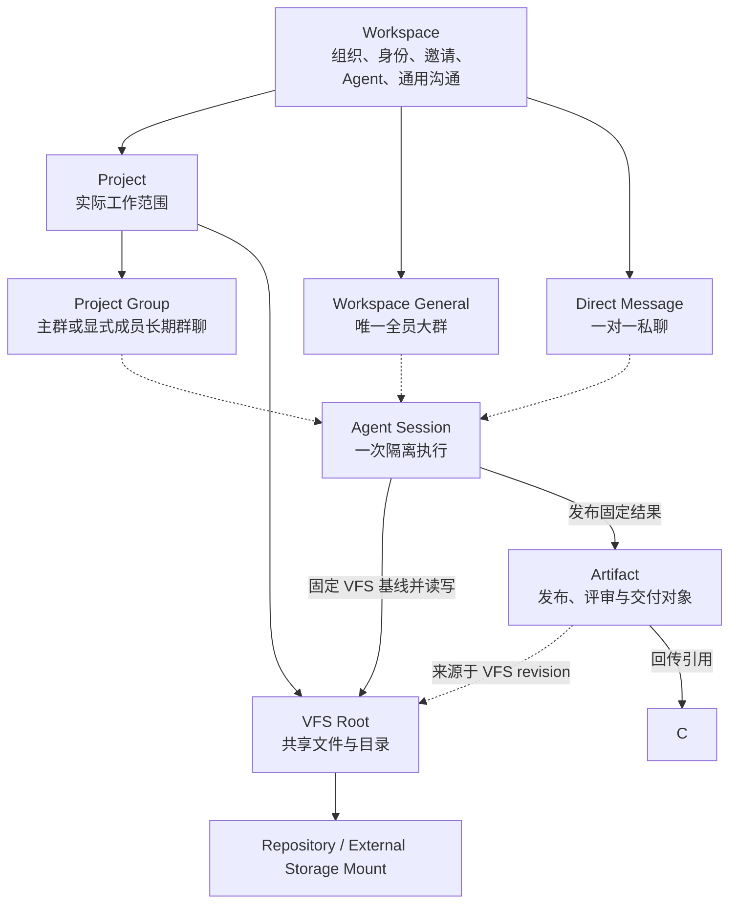
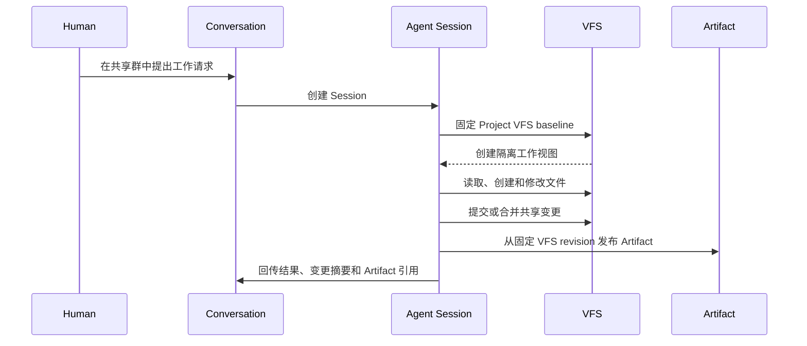

# Workspace、Project、Conversation 与 VFS 边界

> 状态：Phase 1 Implemented / VFS and Session Deferred
>
> 2026-08-27 实施边界：本轮已经落地 Workspace 控制面弱化、Project 内容与成员边界、Workspace 唯一全员大群与一对一私聊、Project 主群与多个固定群聊、WorkItem 独立评论区，以及折叠式 Project 导航。Artifact/VFS 和新的 Agent Session 领域模型均未纳入本轮。

当前正式 Conversation 类型不是“任意 Workspace Conversation + 可选 `project_id`”，而是具有独立不变量的联合类型：

```text
workspace_general   Workspace 唯一全员大群
direct_message      Workspace 内固定一对一私聊
project_group       Project 主群或显式成员长期群聊
```

下文的 VFS、发布来源和 Session 隔离仍是后续方案，不应被理解为当前 schema、API 或 Runtime 已实现。

## 1. 背景

当前设计同时把 Workspace 和 Project 建模为协作范围：两者都有成员、Conversation、权限和资源入口；Project 另外关联可选 Repository，Artifact 则保持 Workspace 级 identity 并通过 Association 出现在 Project 中。

这套模型在“Project 是一个项目子团队”这个前提下是自洽的，但会产生三个问题：

1. Workspace 与 Project 都像完整协作空间，职责重复；
2. Project 既管理参与者，又承担文件和执行上下文，产品含义不够单一；
3. Artifact 与本机 Working Copy 之间缺少共享工作文件层，导致 Project、Repository 和 Artifact 被迫共同代偿文件系统能力。

本提案引入 VFS（Virtual File System，面向 Human 与 Agent 的共享工作文件系统）作为独立领域层，并重新划分 Workspace、Project、Conversation、Session 与 Artifact 的职责。

## 2. 核心判断

系统需要区分五类边界：

| 边界 | 回答的问题 | 核心对象 |
| --- | --- | --- |
| 租户与组织边界 | 谁属于这个组织，哪些身份、Agent 和策略由同一权威管理 | Workspace |
| 工作资源边界 | 围绕哪组文件、Repository、配置和工作状态开展工作 | Project + VFS |
| 协作可见性边界 | 谁参与讨论，谁能读取和发布消息 | Conversation |
| 执行隔离边界 | 某个 Agent 这一次基于什么上下文执行和修改 | Session |
| 发布与评审边界 | 哪个结果被正式命名、引用、评审和交付 | Artifact |

核心原则是：

> Workspace 是组织与治理外壳，Project 是 VFS 上的实际工作空间，Conversation 是共享协作群，Session 是一次隔离执行，Artifact 是从工作状态中发布出来的成果。

数据库中的 `workspace_id` 仍然是所有共享对象的租户归属和审计边界，但技术归属不等于产品语义上的所有权。

## 3. 目标关系



当前保留一套 Conversation 记录，但在领域接口中使用强类型 scope：

```text
Conversation
├── workspace_general  恰好一个，Human Membership 派生参与
├── direct_message     Workspace 内固定两人
└── project_group      绑定一个 Project，project_all 或 explicit
```

- `project_id = null` 不能任意创建 Workspace Channel，只能表示系统大群或 DM；
- `project_id != null` 必须满足 Project Group 的成员和管理不变量；
- 一个 Project 可以被多个长期 Conversation 使用；
- 群聊不会因为一次 Agent 实现而创建或销毁；Session 作用域另案设计。

## 4. Workspace 应当削弱什么

如果保留强 Project，Workspace 就不能继续作为第二套完整工作空间。Workspace 应退回控制平面，只保留：

- Human identity 与 Workspace Membership；
- Agent identity、Computer、Runtime Catalog 与 Human Owner；
- Workspace 级安全策略、审计、配额和生命周期治理；
- Project 目录、创建资格和全局发现入口；
- 少量不依赖具体 Project 的通用 Conversation 与 DM；
- 所有共享对象的租户隔离和逻辑权威。

Workspace 应弱化或移出主要产品入口的能力：

- 不再是日常文件工作的默认空间；
- 不再用一个扁平的 Workspace Artifact 列表承载全部工作文件；
- 不直接承载 Repository、Working Copy、Session 工作目录和项目执行配置；
- Workspace Membership 不自动等价于 Project 内容访问权；
- Workspace Owner 拥有治理与恢复能力，不必天然拥有所有 Project 内容读取权。

因此：

```text
Workspace Membership
= 该 Human 或 Agent 属于组织，可以被加入 Project 或 Conversation

Project Participation
= 该 Human 或 Agent 可以访问这块实际工作空间

Conversation Audience
= 该 Human 或 Agent 可以参与这段共享讨论
```

三者不应再互相隐式等价。

## 5. Project 的重新定位

Project 不再是一个缩小版 Workspace，也不只是一个 Git Repository。它是 VFS 上有稳定 identity 的工作范围，负责聚合：

- 一个稳定的 VFS root；
- 文件、目录和共享工作状态；
- 零到多个 Repository 或外部存储挂载；
- Project instructions、环境配置和执行约束；
- Project Participation 与 VFS 访问权限；
- 与该工作范围相关的 Session、Artifact 和审计来源。

概念上可表示为：

```text
Project
├── identity / name / description
├── VFS root
│   ├── source/
│   ├── docs/
│   ├── research/
│   ├── drafts/
│   └── outputs/
├── repository mounts 0..N
├── project instructions
├── execution configuration
└── participation / ACL
```

Project 可以只包含普通文件，也可以挂载一个或多个 Repository。Repository 是文件来源和版本协议，不再是 Project 的身份。

## 6. VFS 是缺失的共享工作层

VFS 不是简单增加一张 `files` 表，也不要求第一版立即实现操作系统级 FUSE 或全量分布式文件系统。它首先是 Workspace Authority 管理的逻辑文件命名空间和版本协议。

VFS 至少需要表达：

1. **层级命名空间**：目录、文件、稳定 node identity 与可变 path；
2. **工作版本**：内容 revision、目录快照和基线引用；
3. **标准文件操作**：list、read、write、create、move、rename、copy、delete；
4. **来源挂载**：Git Repository、上传文件、对象存储或其他外部文件源；
5. **Session 隔离视图**：每次执行固定基线，在独立 workspace、branch 或 worktree 中修改；
6. **显式合并与发布**：本地写盘不自动成为共享事实，必须提交、合并或发布；
7. **权限与最小授权**：按 Project、path、operation 和 Session 发放短期能力；
8. **来源追踪**：记录 Human、Agent、Session、base revision 和变更 lineage。

一个最小但完整的 VFS 纵向链可以是：



## 7. VFS、Working Copy 与 Artifact 的区别

| 对象 | 性质 | 是否共享 | 是否有路径树 | 主要用途 |
| --- | --- | --- | --- | --- |
| Local Working Copy / Worktree | 某台 Computer 上的执行物化 | 默认不是 Workspace 事实 | 有 | Runtime 执行、Git 操作 |
| VFS | 权威或可提交的共享工作状态 | 是 | 有 | Human 与 Agent 持续协作 |
| Artifact | 被命名和发布的成果对象 | 是 | 不要求 | 引用、版本、评审、交付 |

Artifact 不应继续代替整个共享文件系统：

- 不是所有 VFS 文件都需要成为 Artifact；
- Artifact 通常来源于一个 VFS file、directory 或固定 revision；
- VFS 中的 draft 可以频繁变化，Artifact publication 必须固定可追溯版本；
- Message 引用 Artifact 时引用的是发布结果，而不是隐含读取某个不断变化的工作文件；
- Artifact 的 creator、producing Session、source VFS node 和 source revision 应分别记录。

可以用以下关系表达：

```text
VFS Node + Revision
        ↓ publish
Artifact + Artifact Revision
        ↓ reference
Conversation Message / Review / Delivery
```

## 8. Conversation 与 Session

Conversation 的目标是长期团队协作，不应该等于一次 Agent 实现：

- Conversation 管理固定或显式的 audience、消息、Thread 与共享决策；
- Project 绑定只提供工作文件上下文，不自动决定全部 Conversation 成员；
- 一个 Conversation 内可以产生多个 Session；
- 一个 Session 对应一个具体执行目标、上下文基线和执行生命周期；
- Session 的详细执行历史不需要全部刷入群聊，但状态、结果、文件变更和 Artifact 必须可回传和审计。

建议的执行关系是：

```text
Conversation 1 ──> N Thread
Conversation 1 ──> N Agent Request
Agent Request 1 ──> N Session / Attempt
Session N ──> 1 Project VFS baseline
Session 1 ──> N VFS changes
Session 1 ──> 0..N Artifact publications
```

## 9. 权限不变量

引入 VFS 后，消息权限、文件权限和执行权限必须分开判断：

```text
can_read_conversation
= active Workspace Membership
  + Conversation Audience

can_read_or_write_project_files
= active Workspace Membership
  + Project Participation
  + VFS path permission

can_execute_agent_session
= Conversation request authority
  + Project/VFS access
  + bounded Session capability
  + eligible Runtime/Computer
```

第一版可采用一个严格且容易解释的挂载约束：

> Conversation 绑定 Project 时，所有能够读取该 Conversation 内容的参与者必须至少拥有 Project 的基础读取权限；绑定不会自动向 Conversation 成员授予 Project 权限。

更复杂的按消息过滤、按引用降级或派生内容脱敏不应作为第一版默认行为。

## 10. 与当前设计的主要差异

| 当前设计 | 本提案 |
| --- | --- |
| Workspace 与 Project 都是完整协作范围 | Workspace 是组织治理边界，Project 是实际工作资源边界 |
| `Workspace → Project → Conversation` | Conversation 属于 Workspace tenant，可选绑定 Project |
| Project Membership 自动投影全部 public Project Channel | Project Participation 管文件访问，Conversation Audience 管讨论参与 |
| Project 最多一个 Primary Repository | Project VFS 可挂载零到多个文件来源，具体数量需另行决策 |
| Artifact 是主要共享文件对象 | VFS 承载工作文件，Artifact 承载发布成果 |
| Repository Working Copy 或 scratch 是主要执行目录 | Session 基于 VFS baseline 获得隔离执行视图 |
| Conversation 与 Run 之间没有独立的产品级 Session 概念 | Session 成为一次 Agent 实现及文件变更的边界 |

这不是字段重命名，而是领域关系调整。若接受，需要新的 ADR 明确替代现有 Project scope、Artifact ownership、Conversation scope 和 Repository execution 决策，再制定数据和产品迁移方案。

## 11. 建议的最小落地范围

为避免一开始构建过度复杂的分布式文件系统，第一版 VFS 可以只实现一条端到端路径：

1. Workspace 创建 Project，并为其建立 VFS root；
2. Project 中创建目录并上传、读取、修改普通文件；
3. 一个 Conversation 可选绑定该 Project；
4. 从 Conversation 消息创建 Agent Session；
5. Session 固定 VFS revision 并获得隔离工作目录；
6. Agent 修改文件后显式提交回 VFS；
7. 从某个固定文件 revision 发布 Artifact；
8. Artifact 作为普通 Message 引用回到原 Conversation。

第一版暂不要求：

- 通用 FUSE 挂载；
- 离线多主写入；
- 任意云盘双向同步；
- 自动无冲突合并所有二进制格式；
- 跨 Workspace 文件共享；
- 一次 Conversation 同时挂载多个 Project。

## 12. 尚未决策的问题

以下问题需要在接受本提案前单独决策：

1. Project 是否固定一个 VFS root，还是可以组合多个独立 root；
2. Conversation 第一版是否只允许绑定零或一个 Project；
3. Project Participation 是否保留 `manager | member`，还是改为独立 ACL；
4. Workspace 通用 Conversation 是否可以访问 `/shared` VFS 区域；
5. Artifact 是 Project-primary，还是继续保留 Workspace identity 加来源关系；
6. Markdown 实时协作状态迁入 VFS 后，Artifact Current State 是否仍然存在；
7. Repository mount、VFS revision 与 Git commit 三者如何映射；
8. 多 Agent 同时修改同一目录时采用 lease、branch、merge 还是组合策略；
9. Project archive/delete 如何影响 VFS、Conversation、Session 和 Artifact lineage；
10. 现有 Workspace Artifact 与 Project Association 如何转换为 VFS node 和 publication provenance。

## 13. 当前结论

当前边界混乱的根因不是 Project 或 Conversation 单独定义错误，而是缺少位于本机执行和发布成果之间的共享文件工作层。

```text
Local Working Copy / Worktree
        ↓ 显式提交或同步
VFS shared working state
        ↓ 固定 revision 并发布
Artifact
        ↓ 在协作中引用、评审和交付
Conversation
```

引入 VFS 后，Workspace 可以被削弱为组织与治理边界，Project 获得明确的文件工作空间语义，Conversation 专注于团队协作，Session 专注于 Agent 执行，Artifact 回到发布成果而不是通用文件系统的位置。
