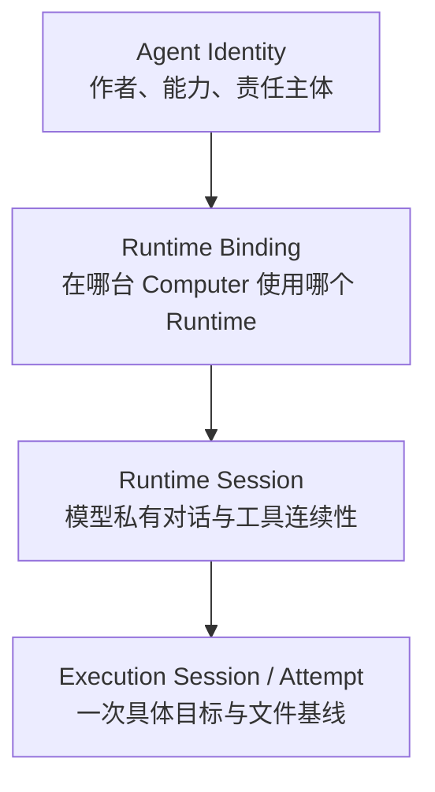
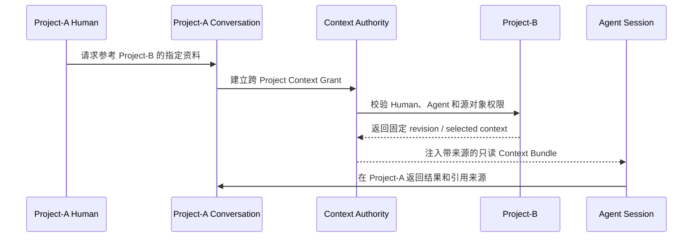

# 会议议题二：Agent 生命周期、Session 范围与跨 Project 上下文

> 状态：Decision Implemented
>
> 目标：区分 Agent identity、Runtime Binding、Agent Session 与单次执行的生命周期，决定 Agent 是否应跨 Project，以及跨 Project 时如何安全、可解释地获得其他 Project 的对话和文件上下文。
>
> 关联材料：[Workspace、Project、Conversation 与 VFS 边界提案](./11-workspace-project-vfs-boundaries.md)、[Local Agent Module](./05-local-agent-module.md)、[Context 与 Privacy](./08-context-and-privacy.md)、[ADR-0007](../adr/0007-agent-identity-is-independent-of-runtime.md)、[ADR-0045](../adr/0045-persistent-agent-inbox-is-independent-of-run-attempt.md)

> 实施说明：本议题中的 Session 隔离决策已落地。Agent identity 仍属于 Workspace；Local Computer 按 Mention `agentRequestId` 或 WorkItem `workItemId` 建立 Logical Session。Runtime ACP process/session 只是可丢弃 cache，服务端从 Workspace、Project、Conversation/WorkItem 事实动态重建确定性 JSONL，并用 `contextHash` 判断是否可以复用 cache。跨 Project Context Grant 仍是独立的后续议题。

## 1. 本次会议要回答的问题

这里需要拆开两个容易混淆的问题：

1. Agent 的稳定身份属于 Workspace 还是 Project？
2. Runtime Session 的上下文范围属于 Workspace、Project、Conversation，还是一次任务？

Agent 能够参与多个 Project，不等于必须用一个 Runtime Session 处理所有 Project；反过来，Session 按 Project 隔离，也不代表需要为每个 Project 创建新的 Agent identity。

核心问题是：

> 跨 Project 是 Agent 的能力与授权问题，还是同一个 Session 的上下文连续性问题？

## 2. 当前设计基线

当前模型区分：

| 对象 | 当前范围 | 当前生命周期 |
| --- | --- | --- |
| Workspace Agent | 固定属于一个 Workspace | 长期稳定 identity |
| Agent Workspace Membership | Workspace | active/terminal participation tenure |
| Project Membership | Project | 独立参与期 |
| Runtime Binding | Agent + Computer + Runtime | 可替换，revision fencing |
| Logical Agent Session | Mention 按 `agentRequestId`、WorkItem 按 `workItemId` | Mention 完成即关闭；WorkItem 随任务生命周期 |
| Runtime Session cache | 每个 Logical Session 可有一个 ACP process/session | 可丢弃；按 Session key 与 `contextHash` 重建 |
| Run / Attempt | 一次显式执行 | 短期、可重试 |

旧实现的 Local Agent Session 近似 key 是：

```text
Agent + active Runtime Binding + adapter instance
```

当前实现使用：

```text
Mention:   agentRequestId
WorkItem:   workItemId
```

同一个 Agent 即使在同一个 DM/Conversation 连续收到多条 Mention，也会进入不同 Logical Session；WorkItem 不会以副本进入 Mention Session。触发消息和任务评论显式引用的 WorkItem 只以 ID 和 CLI 读取指令进入上下文，Agent 可通过 `teamctl work-item read <id>` 读取该实体的最新状态、评论和 Artifact；同一 Project 内其他 WorkItem 也可由具有 Project membership 的 Agent 读取。Runtime 私有历史不会成为权威数据，Workspace 只保存 Inbox、Message、Artifact、WorkItem 和执行事实。

## 3. 当前模型的潜在冲突

### 3.1 Agent identity 与 Runtime context 被生命周期绑定

Workspace Agent 作为稳定身份跨 Project 是合理的，但“每个 Agent 一个长期 Session”会让 Runtime 私有历史天然跨 Project。这样可能出现：

- Project-A 的内容留在 Session 私有历史中；
- Agent 随后在 Project-B 回答时受到 Project-A 隐式上下文影响；
- Workspace 无法审计 Runtime 实际复用了哪些历史；
- Project 权限被撤销后，Runtime 私有历史仍可能保留旧内容；
- 多个 Project 同时唤醒同一 Session 时产生调度和上下文切换问题。

### 3.2 跨 Project 能力与跨 Project 信息读取混在一起

“Agent 能跨项目工作”至少有三种不同含义：

1. 同一个 Agent identity 可以被加入多个 Project；
2. Agent 可以在 Project-A 的工作中显式读取 Project-B 的资料；
3. Agent 可以自动把其他 Project 的对话历史当作当前上下文。

第一种是身份复用，第二种是授权访问，第三种是隐式上下文共享。三者风险和产品价值完全不同，不能由“同一个 Session”自动推导。

### 3.3 Conversation context 与 Project context 不同

一次 Agent 响应可能需要：

- 当前 Topic/Thread 的消息；
- 当前 Conversation 的必要历史；
- 当前 Project 的 VFS 文件与 instructions；
- 另一个 Project 的某个 Artifact 或固定文件 revision；
- Workspace 级 Agent profile 和通用规则。

这些来源应分别授权和记录，而不应笼统称为“Agent 记得”。

## 4. 必须区分的四层生命周期



| 层 | 应回答的问题 |
| --- | --- |
| Agent Identity | 谁在团队中发言、承担责任和拥有能力 |
| Runtime Binding | 这个 Agent 当前由哪台 Computer 和哪个 Runtime 承载 |
| Runtime Session | 哪些模型私有上下文可以连续复用 |
| Execution Session | 这次工作使用哪些消息、文件、权限、预算和输出位置 |

会议不应只选择一个“Agent 生命周期”，而要分别决定四层的 key 和终止条件。

## 5. Session 范围的可选模型

### 方案 A：Workspace Agent 单一长期 Session

```text
session_key = agent_id + runtime_binding_revision
```

所有 Project 和 Conversation 的 Inbox 都进入一个 Session。

优点：

- Agent 具有最强的连续人格和长期工作感；
- Runtime 数量少，恢复逻辑简单；
- Agent 可以自然关联过去处理过的事项。

风险：

- Project 上下文容易串扰；
- 权限撤销无法清除不可见的 Runtime 私有历史；
- 并行处理多个 Project 困难；
- 无法准确解释某次回答用了哪些跨项目信息。

### 方案 B：每个 Agent 每个 Project 一个 Session

```text
session_key = agent_id + project_id + runtime_binding_revision
```

Project-less Conversation 可使用单独的 Workspace Session 或临时 Session。

优点：

- Project 上下文和 VFS 工作目录天然隔离；
- 同一个 Agent identity 仍可加入多个 Project；
- Project 权限撤销可以 fence 对应 Session；
- 不同 Project 可并行处理。

风险：

- Agent 的连续记忆被分散；
- 跨项目工作必须建立显式上下文传递；
- Project-less Conversation 需要单独规则；
- Runtime Session 数量增加。

### 方案 C：每个 Agent 每个 Conversation 一个 Session

```text
session_key = agent_id + conversation_id + runtime_binding_revision
```

优点：

- 模型私有历史与用户可见讨论范围最接近；
- Conversation 归档或成员变化可以精确 fence；
- 一个 Project 内多个话题不会互相污染。

风险：

- Session 数量最多；
- 同一 Project 文件上下文会在多个 Session 中重复建立；
- Conversation 之间的连续工作需要显式 handoff；
- 如果 Conversation 是普通大群，Session 仍可能过于宽泛。

### 方案 D：分层 Session

Agent identity 属于 Workspace，Project 维护持久工作记忆或 Session Pool，Conversation/Topic 的具体请求使用隔离 Execution Session：

```text
Workspace Agent Identity
└── Project Context 0..N
    ├── durable approved memory
    ├── Project VFS access
    └── Conversation/Topic Execution Session 0..N
```

优点：

- 身份跨 Project，默认上下文按 Project 隔离；
- 可以并行处理多个 Topic；
- 持久知识可以从 Runtime transcript 中抽离为可审计事实。

风险：

- 需要定义 Project memory、Session resume 和 Execution Session 的边界；
- Context Assembler 和权限模型更复杂；
- Runtime 是否支持 fork/load/resume 会影响实现方式。

## 6. 方案比较

| 维度 | A：Workspace Session | B：Project Session | C：Conversation Session | D：分层 Session |
| --- | --- | --- | --- | --- |
| Agent 连续性 | 最强 | 项目内连续 | 对话内连续 | 可配置 |
| Project 隔离 | 弱 | 强 | 强 | 强 |
| Topic 隔离 | 弱 | 中 | 取决于 Conversation | 强 |
| 跨 Project 能力 | 隐式 | 显式 | 显式 | 显式 |
| 并行执行 | 较弱 | 较强 | 强 | 强 |
| Session 数量 | 最少 | 中 | 多 | 多 |
| 权限可解释性 | 弱 | 较强 | 较强 | 最强但实现复杂 |

## 7. 如果 Agent 需要跨 Project，应如何提供上下文

跨 Project 能力不应等于自动拼接其他 Project 的完整 Conversation 历史。建议会议从以下上下文来源分别讨论授权：

```text
Context Bundle
├── current Conversation / Topic messages
├── current Project instructions
├── current Project VFS snapshot
├── explicit cross-Project references
│   ├── Artifact revision
│   ├── VFS file/directory revision
│   └── selected Conversation summary/messages
├── Workspace Agent profile
└── approved durable memory
```

### 7.1 显式跨 Project 引用

Project-A 的用户要求 Agent 参考 Project-B 时，应形成一个可审计的 Context Grant：

```text
requesting scope
+ source Project
+ exact source objects/revisions
+ read-only | read-write operation
+ authorized Human/Policy
+ expiration/fence
```

不得仅因为 Agent 同时是两个 Project 的成员，就自动把 Project-B 的所有对话和文件注入 Project-A。

### 7.2 对话上下文的处理

其他 Project 的 Conversation 不适合作为隐藏 transcript 整体注入。可讨论三种显式方式：

1. 引用固定 Message/Thread/Topic 范围；
2. 生成带来源和截止位置的可审计 Summary；
3. 将已经形成的共识发布为 Artifact 或 VFS 文件，再跨 Project 引用。

无论哪种方式，都要记录来源 Project、Conversation、frontier/revision 和授权依据。

### 7.3 权限撤销

当 Agent 失去 Project-B 权限时：

- 新 Context Bundle 不得继续读取 Project-B；
- Project-B 对应 Session 或 capability 必须 fence；
- 仍在 Runtime 私有历史中的内容如何处理必须由 Session 范围决策回答；
- 已经合法发布到 Project-A 的派生成果是否保留，需要独立的数据传播策略。

## 8. 跨 Project 执行流程示例



这个流程强调：跨 Project 是显式授权的数据流，不依赖 Agent 在另一个 Session 中“碰巧记得”。

## 9. 会议验收场景

### 场景一：一个 Agent 同时属于两个 Project

Project-A 和 Project-B 同时 @Agent。系统必须说明使用几个 Runtime Session、是否并行、各自工作目录和上下文如何隔离。

### 场景二：Project-A 请求参考 Project-B

同一个 Human 和 Agent 都有两个 Project 权限。系统必须说明哪些 Project-B 对话或文件进入上下文，以及如何审计。

### 场景三：Agent 被移出 Project-B

Project-A 的 Session 之前曾合法使用 Project-B 内容。系统必须说明撤权后哪些 Session 被 fence、哪些已发布结果继续保留。

### 场景四：Project-less Workspace Conversation

用户在通用群中 @Agent。系统必须说明 Session key、默认文件上下文，以及它是否可以访问任意 Project。

### 场景五：多个 Topic 并行执行

同一 Project 内两个 Topic 同时请求同一个 Agent。系统必须说明一个 Session 串行、多个 Session 并行或 Session Pool 调度的选择。

## 10. 已形成的决策与后续问题

- [x] Agent identity 属于 Workspace；
- [x] 同一个 Agent 可以加入多个 Project；
- [x] Runtime Session 的默认 key：Mention `agentRequestId`，WorkItem `workItemId`；
- [x] Logical Session 成为运行时上下文边界；Runtime cache 不作为权威会话；
- [x] Project-less Conversation 使用 Mention `agentRequestId` Session，默认不带 Project 上下文；
- [ ] 跨 Project Context Grant 的建立者和授权条件；
- [ ] 其他 Project Conversation 以原文、选择范围、Summary 还是 Artifact 进入上下文；
- [x] Project 权限在每次 Session-input/Gateway 操作重新鉴权；撤权后不能建立或继续使用对应 Project 上下文，旧 cache 可丢弃；
- [x] 同一 Agent 的不同 Logical Session 互相隔离，可分别拥有 Runtime cache、work directory、receipt 和 held draft；
- [x] Session JSONL、VFS/Artifact 读取和 publication 均绑定当前 Session 的 Agent/Project 权限；
- [ ] 是否为 Project 增加可审计的 durable approved memory。

## 11. 决策记录模板

```text
Decision: Mention 与 WorkItem 使用独立 Logical Session；Runtime session 仅为可丢弃 cache。

Agent identity scope:

Runtime Session key: `Agent × (Mention agentRequestId | WorkItem workItemId) × binding revision × adapter instance`

Execution Session definition: 每个 Logical Session 以确定性 Workspace JSONL 和 `contextHash` 建立一次或多次 Run/Attempt；不复用其他 Session 的私有 runtime 历史。

Cross-Project capability:

Cross-Project context sources:

Permission and revocation rule:

Concurrency rule:

MVP scope: Mention/WorkItem 隔离、Session-input JSONL、context hash、per-session gateway/workdir/held draft、request-scoped Inbox claim。

Deferred questions:
```
